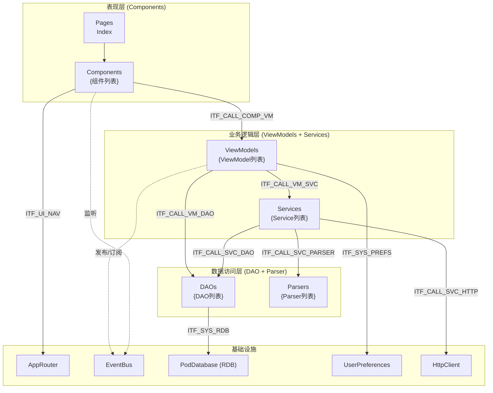

# {变更名称} - 架构变更

## 1 变更概述

| 项目 | 内容 |
| ---- | ---- |
| 变更类型 | {新增/修改/重构} |
| 变更日期 | {YYYY-MM-DD} |
| 变更人 | {姓名} |

## 2 变更原因

{描述为什么要进行此次架构变更，如：}
- 原有架构无法支持新功能需求
- 性能瓶颈需要架构优化
- 可维护性差，需要重构
- 其他原因

## 3 变更点

{列举本次架构变更的具体内容}

### 3.1 {变更点名称}

{详细描述变更内容}

### 3.2 {变更点名称}

{详细描述变更内容}

## 4 变更后架构

### 4.1 整体分层

{描述变更后的系统分层架构}



### 4.2 表现层

| 页面 | 路由 | 职责 |
| ---- | ---- | ---- |
| Index | `pages/Index` | 主入口，承载 Navigation 容器和底部 Tab |
| {页面名称} | `{路由路径}` | {职责描述} |

### 4.3 业务逻辑层

#### 4.3.1 ViewModels（{数量} 个）

| ViewModel | 职责 |
| --------- | ---- |
| {名称} | {职责描述} |

#### 4.3.2 Services（{数量} 个，均为单例）

| Service | 职责 |
| ------- | ---- |
| {名称} | {职责描述} |

### 4.4 数据访问层

#### 4.4.1 DAO（{数量} 个）

| DAO | 表名 | 职责 |
| --- | ---- | ---- |
| {名称} | {表名} | {职责描述} |

#### 4.4.2 Parser（{数量} 个）

| Parser | 职责 |
| ------ | ---- |
| {名称} | {职责描述} |

### 4.5 内部接口

#### 4.5.1 路由导航

| 源页面 | 目标路由 | 目标页面 | 说明 |
| ------ | -------- | -------- | ---- |
| {源} | `{路由}` | {目标} | {说明} |

#### 4.5.2 事件总线

| 发起方 | 事件 | 订阅方 |
| ------ | ---- | ------ |
| {发起模块} | `{事件名称}` | {订阅模块} |

#### 4.5.3 直接调用

| ID | 调用方 | 被调用方 | 说明 |
| -- | ------ | -------- | ---- |
| {接口ID} | {调用方} | {被调用方} | {说明} |

### 4.6 数据模型

```mermaid
erDiagram
    {实体1} ||--o{ {实体2} : "{关系描述}"
    {实体1} ||--|| {实体3} : "{关系描述}"

    {实体1} {
        {字段类型} {字段名} PK
        {字段类型} {字段名}
    }
```

## 5 兼容性说明

{描述变更对现有功能的影响及兼容性处理}

## 6 迁移方案

{如果涉及现有数据的迁移，描述迁移步骤}