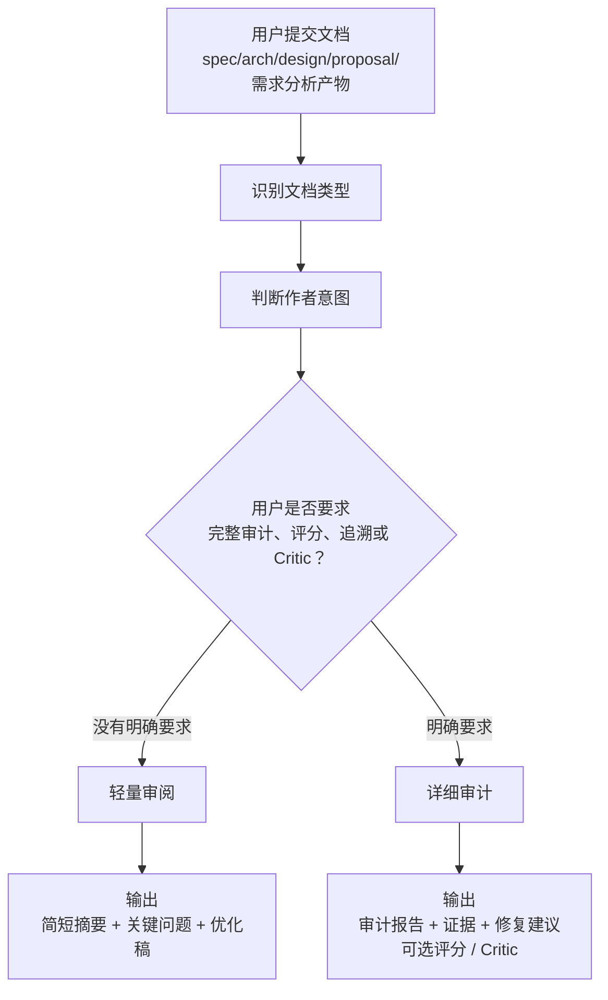
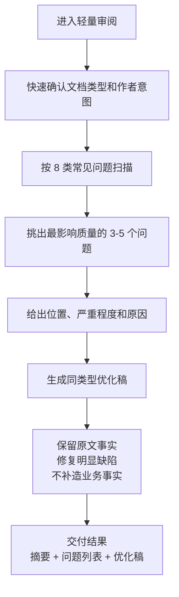
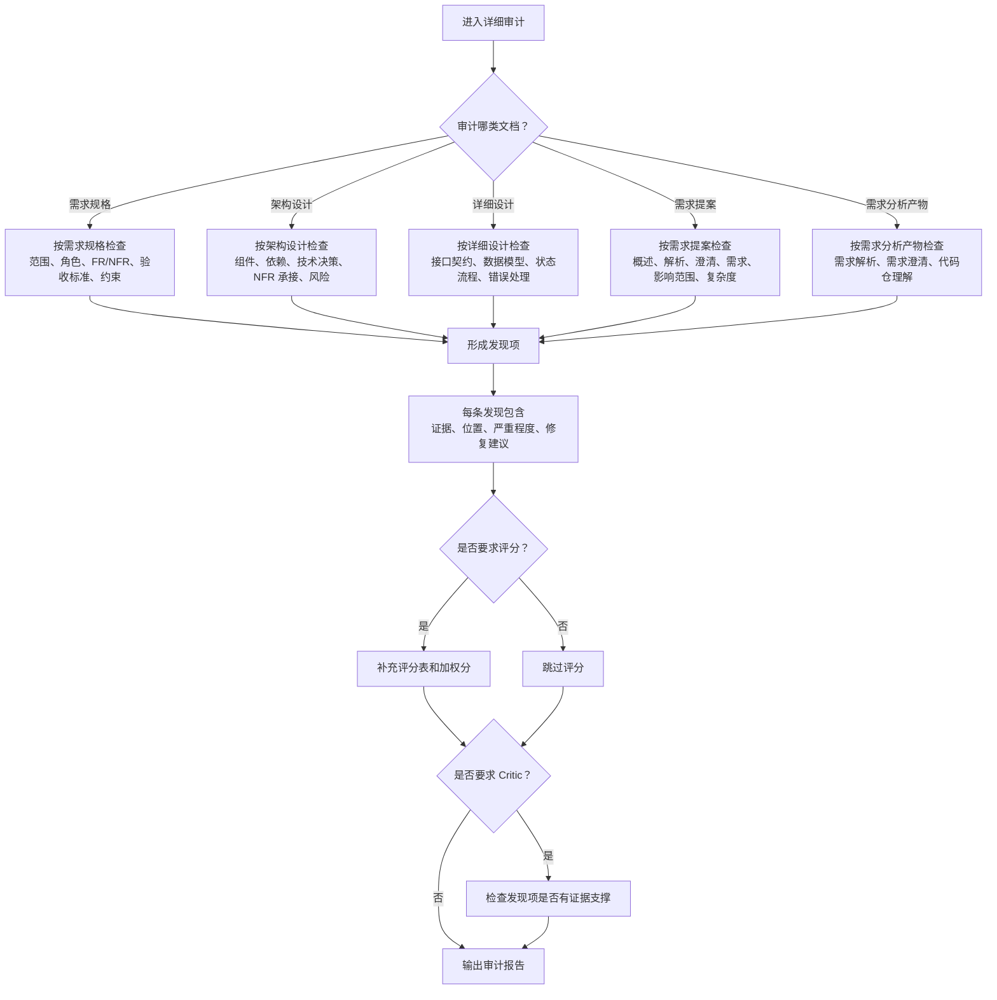
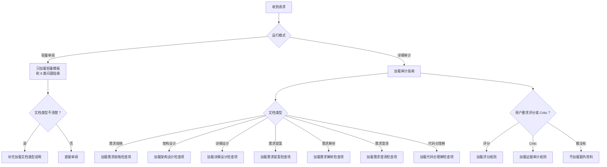
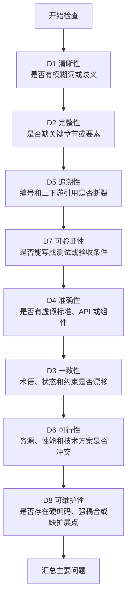

# aid-reviewing 文档审阅

面向 `spec`、`arch`、`design`、需求提案及需求分析产物的 Markdown 文档审阅技能。

## 支持的文档类型

| 类型 | 说明 |
|------|------|
| spec | 需求规格文档 |
| arch | 架构设计文档 |
| design | 详细设计文档 |
| proposal | 需求提案 |
| rq-parse | 需求解析产物 |
| rq-clarify | 需求澄清产物 |
| rq-codebase | 代码仓理解产物 |

## 两种模式

### 轻量审阅（默认）

适合日常文档优化，输出简短摘要 + 关键问题 + 优化稿。

### 详细审计（audit mode）

用户明确要求时进入，输出完整审计报告 + 证据 + 修复建议，可选评分/Critic。

## 流程图

### 总览



### 轻量审阅流程



### 详细审计流程



### 资料加载规则



### 8 类问题检查顺序



## 参考文件索引

### 目录结构

```
references/
├── audit-mode-guide.md         # 详细审计入口指南
├── audit-profiles/             # 审计配置（按文档类型）
│   ├── spec.md
│   ├── arch.md
│   ├── design.md
│   ├── proposal.md
│   ├── rq-parse.md
│   ├── rq-clarify.md
│   └── rq-codebase.md
├── audit-rules/                # 检查项（按文档类型）
│   ├── check-items-spec.md
│   ├── check-items-arch.md
│   ├── check-items-design.md
│   ├── check-items-proposal.md
│   ├── check-items-rq-parse.md
│   ├── check-items-rq-clarify.md
│   └── check-items-rq-codebase.md
├── audit-scoring/              # 评分规则
│   └── score.md
├── audit-critic/               # Critic 自查规则
│   └── critic.md
├── concise-review-template.md  # 轻量审阅输出模板
├── concise-dimensions-guide.md # D1-D8 缺陷检测清单
├── doc-type-profiles.md        # 文档类型说明
└── skill-improvement-guide.md  # Skill 优化建议
```

### 轻量审阅模式

| 加载时机 | 文件 | 用途 |
|----------|------|------|
| 必选 | `references/concise-review-template.md` | 输出模板 |
| 必选 | `references/concise-dimensions-guide.md` | D1-D8 缺陷检测清单 |
| 条件 | `references/doc-type-profiles.md` | 仅当文档类型不明确时加载 |

**禁止加载（轻量模式）：**
- `audit-rules/check-items-*.md`
- `audit-scoring/score.md`
- `audit-critic/critic.md`

### 详细审计模式

| 步骤 | 文件 | 用途 |
|------|------|------|
| 必选（入口） | `references/audit-mode-guide.md` | 路由表、解析规则、输出顺序 |
| 条件（按类型） | `references/audit-profiles/spec.md` | 需求规格审计配置 |
| 条件（按类型） | `references/audit-profiles/arch.md` | 架构设计审计配置 |
| 条件（按类型） | `references/audit-profiles/design.md` | 详细设计审计配置 |
| 条件（按类型） | `references/audit-profiles/proposal.md` | 需求提案审计配置 |
| 条件（按类型） | `references/audit-profiles/rq-parse.md` | 需求解析审计配置 |
| 条件（按类型） | `references/audit-profiles/rq-clarify.md` | 需求澄清审计配置 |
| 条件（按类型） | `references/audit-profiles/rq-codebase.md` | 代码仓理解审计配置 |
| 条件（按类型） | `references/audit-rules/check-items-spec.md` | 需求规格详细检查项 |
| 条件（按类型） | `references/audit-rules/check-items-arch.md` | 架构设计详细检查项 |
| 条件（按类型） | `references/audit-rules/check-items-design.md` | 详细设计详细检查项 |
| 条件（按类型） | `references/audit-rules/check-items-proposal.md` | 需求提案详细检查项 |
| 条件（按类型） | `references/audit-rules/check-items-rq-parse.md` | 需求解析详细检查项 |
| 条件（按类型） | `references/audit-rules/check-items-rq-clarify.md` | 需求澄清详细检查项 |
| 条件（按类型） | `references/audit-rules/check-items-rq-codebase.md` | 代码仓理解详细检查项 |
| 可选 | `references/audit-scoring/score.md` | 加权评分规则 |
| 可选 | `references/audit-critic/critic.md` | Critic 自查规则 |
| 可选 | `references/skill-improvement-guide.md` | Skill 优化建议（面向生成文档的 skill） |

## 缺陷维度（D1-D8）

| 维度 | 名称 | 说明 |
|------|------|------|
| D1 | 清晰性 | 模糊词、歧义表达 |
| D2 | 完整性 | 缺失关键章节或要素 |
| D3 | 一致性 | 术语、状态、约束漂移 |
| D4 | 准确性 | 虚假标准、API、组件引用 |
| D5 | 追溯性 | 编号和上下游引用断裂 |
| D6 | 可行性 | 资源、性能、技术方案冲突 |
| D7 | 可验证性 | 无法写成测试或验收条件 |
| D8 | 可维护性 | 硬编码、强耦合、缺扩展点 |

## 输出原则

- 保留原文已成立的事实
- 修复检测到的所有缺陷
- 合理补全必须标注 `Assumption:` 或 `Reviewer suggestion:`
- 不得捏造业务事实

## 触发方式

当用户提到以下关键词时触发：
- "审阅文档"、"review"、"文档评审"
- "审计"、"audit"
- "优化文档"、"优化提案"