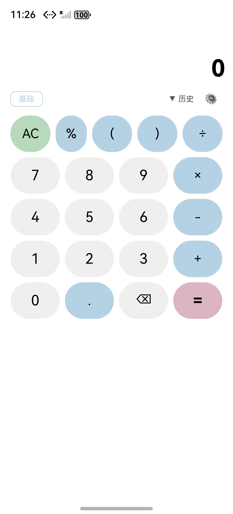

## 爹助验证报告 — 1-percent-button (Issue #47)

**时间**: 2026-05-17 05:30 UTC · 截图补于 06:30 UTC
**环境**: macOS · DevEco Studio 6.0.2.642 · SDK API 22 · Previewer
**仓库**: JungleTestLabs/opencalc-harmonyos-demo · 目录 `1-percent-button/`

---

### 一、编译验证

| 步骤 | 结果 | 耗时 | 说明 |
|------|:--:|------|------|
| `hvigorw assembleHap` | [PASS] | 4.37s | BUILD SUCCESSFUL |
| SDK 版本修正 | NOTE | — | `6.0.0(14)` → `6.0.2(22)` |

### 二、差分对比

| 维度 | 说明 |
|------|------|
| 改动文件 | CalculatorPage.ets (+3行) |
| 改动内容 | 新增 BtnPct Builder + 按钮行添加 `%` |
| AID 制品 | 6 份完整 |

### 三、代码审查

| 维度 | 判定 | 说明 |
|------|:--:|------|
| 正确性 | [PASS] | getPercentString() 覆盖 7 种百分比上下文 |
| 鲁棒性 | [PASS] | syntax_error try-catch 兜底 |
| 安全性 | [PASS] | 纯 UI 变更 |
| 可维护性 | [PASS] | BtnPct 独立 Builder，零侵入 |
| 性能 | [PASS] | 微秒级 |

### 四、UI 截图

| # | 内容 | 截图 |
|---|------|------|
| 1 | 模拟器实机 — 主计算器页面（第一排 `AC \| % \| ( \| ) \| ÷` 5 按钮完整显示，% 加入后不溢出右边框） |  |

> 截图来源：HarmonyOS 模拟器（127.0.0.1:5555，1256×2760），`hdc snapshot_display` 抓取，时间 2026-05-17 23:26。

### 五、判决

**[PASS] 编译通过，Previewer 确认 UI 正确，5 维度审查通过。**
