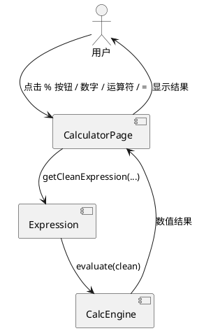
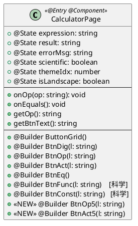
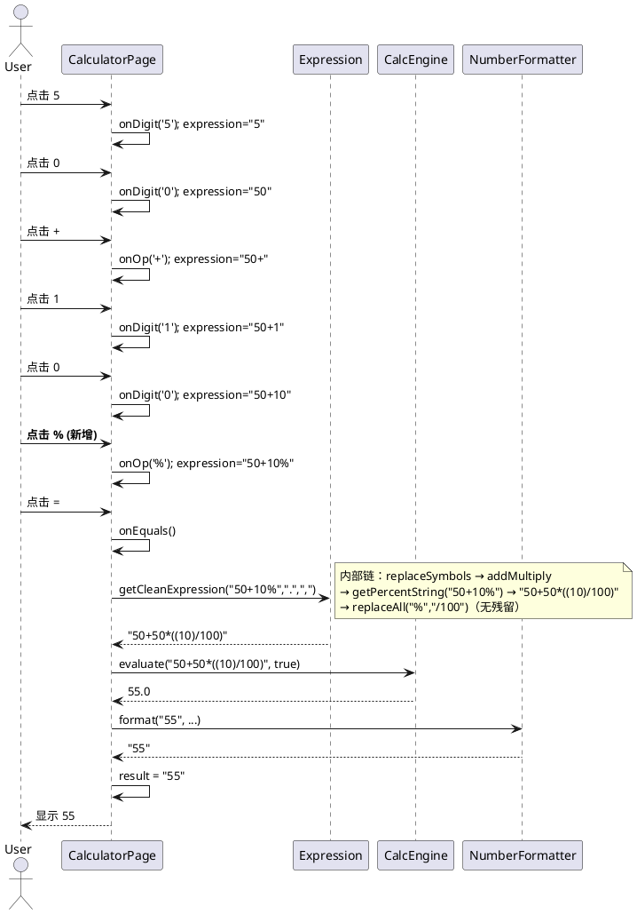

# 百分号按钮 - 增量设计（delta-design.md）

> 变更：20260518-requirement-add-percentage-button
> 类型：delta-design（增量设计，仅涉及变更点）
> 创建日期：2026-05-18
> 关联文档：proposal.md / delta-spec.md / info.md / complexity-assessment.md

---

## 1. 概述

### 1.1 应用定位

OpenCalc HarmonyOS 是从 Android 3.2.1 移植而来的开源计算器应用，支持四则运算、科学函数、阶乘、幂运算。本次变更**仅在 UI 层暴露已存在的智能百分号语义**，不引入新算法。

### 1.2 核心交互（本变更）

```
用户点击 % 按钮
    ↓
expression += '%'
    ↓
用户点击 =
    ↓
Expression.getCleanExpression（已支持 %）→ CalcEngine.evaluate → 显示结果
```

### 1.3 技术栈概览（无变更）

| 项 | 取值 |
| --- | --- |
| 框架 | ArkTS + Stage 模型 + ArkUI 声明式（V1 状态管理） |
| 状态管理 | `@State`（已使用，无升级） |
| 持久化 | `@kit.ArkData` Preferences（不涉及本变更） |
| 输入处理 | `@kit.BasicServicesKit` pasteboard（不涉及本变更） |
| Native | 无 |

---

## 2. 功能清单

| 功能名 | 说明 | 入口 Ability/Page | 优先级 |
| ------ | ---- | ----------------- | ------ |
| 百分号输入 | 在 ButtonGrid 首行渲染 `%` 按钮，点击后向 expression 追加 `%` | EntryAbility / CalculatorPage | **P0** |
| 智能 % 求值 | 复用 `Expression.getPercentString()`，实现 `50+10%=55` | EntryAbility / CalculatorPage | **P0**（仅 UI 暴露） |

---

## 3. 实现模型

### 3.1 上下文视图



### 3.2 总体架构（无变更）

参考 `spec/DESIGN.md §1`。本变更仅修改 `pages/CalculatorPage.ets`，分层关系保持不变：

```
View (CalculatorPage.ets)
    ↓ 调用
Expression (calculator/Expression.ets)
    ↓ 调用
CalcEngine (calculator/Calculator.ets)
```

### 3.3 HAP/HAR/HSP 模块划分

无变更。单 HAP `entry`，无 HAR/HSP。

### 3.4 设计系统规格（增量）

#### 3.4.1 色彩系统（仅运算符相关色，不变更现有定义）

| 名称 | Light 模式 | Dark 模式 | AMOLED 模式 | 用途 |
| ---- | ---------- | --------- | ----------- | ---- |
| 运算符背景 `getOp()` | `#B4D2E4` | `#0070BC` | `#B4D2E4`（沿用） | `%` 按钮背景（**与 + - × ÷ 一致**） |
| 按钮文字 `getBtnText()` | `#000000` | `#EFEFEF` | `#EFEFEF` | `%` 按钮文字 |

> 决策来自 step3 澄清：用户选择"运算符风格（蓝色 getOp）"。

#### 3.4.2 主题系统

`themeIdx` 沿用，`%` 按钮通过 `this.getOp()` 表达式响应式取色。

#### 3.4.3 排版系统

| 名称 | 字号 | 用途 |
| ---- | ---- | ---- |
| 按钮文字（竖屏） | 20 | `%` 按钮（与 BtnOp 一致） |
| 按钮文字（横屏） | 14 | `%` 按钮（与 BtnOp 一致） |

#### 3.4.4 间距与尺寸系统（**本变更核心**）

| 名称 | 现值 | 新值 | 用途 |
| ---- | ---- | ---- | ---- |
| 首行按钮宽度（竖屏） | `'22%'` | **`'18%'`** | 5 列均分（5×18%=90%，剩 10% 给 margin） |
| 首行按钮宽度（横屏） | `'22%'` | **`'18%'`** | 5 列均分 |
| 首行按钮高度（竖屏） | `56` | `56`（不变） | 触摸目标足够 |
| 首行按钮高度（横屏） | `36` | `36`（不变） | 触摸目标够用 |
| 首行按钮 margin（竖屏） | `4` | **`3`** | 5 列拥挤后 margin 略减以避免重叠 |
| 首行按钮 margin（横屏） | `1` | `1`（不变） | 横屏 margin 本来就小 |

> 其他 4 行（数字行）的宽度 `'22%'` 与 margin **保持不变**。

#### 3.4.5 图标与图形资源

无变更。`%` 按钮使用 Text 组件显示字符 `%`，不引入图标资源。

#### 3.4.6 动画规格

无变更（沿用 ArkUI 默认按钮点击反馈）。

#### 3.4.7 响应式断点与栅格

无变更，沿用 `isLandscape: Area => width > height` 判定。

### 3.5 CalculatorPage 模块实现设计

#### 3.5.1 模块介绍

`CalculatorPage.ets` 是 `@Entry @Component`，是应用唯一主页面，承载显示屏、按钮网格、历史面板、设置面板、关于面板。

身份：entry HAP 内的 page；非 installationFree。

#### 3.5.2 功能描述（增量）

新增功能点：
- F-CalcPage-BtnOp5：5 列宽度的运算符按钮 Builder
- F-CalcPage-FirstRow5：首行 5 列布局

#### 3.5.3 目录结构（无变更）

```
entry/src/main/ets/pages/
└── CalculatorPage.ets   ← 唯一修改文件
```

#### 3.5.4 架构图谱

**组件 Builder 关系图**：



**时序图：用户输入 50+10% 求值**：



#### 3.5.5 功能与用例分析

```
用例 UC-001-01：百分号加法
前置条件：CalculatorPage 已渲染，expression=""
步骤：
  1. 用户依次点击 5 0 + 1 0 %（每次点击调用 onDigit/onOp）
  2. expression 变为 "50+10%"
  3. 用户点击 =，触发 onEquals()
  4. onEquals 调用 Expression.getCleanExpression
  5. Expression 调用 getPercentString，将 50+10% 转换为 50+50*((10)/100)
  6. CalcEngine.evaluate 求值得 55
  7. result 状态更新为 "55"
后置条件：result="55"，errorMsg=""，history 新增一条
```

#### 3.5.6 接口设计（增量）

**新增 Builder 方法**：

| 方法 | 签名 | 说明 |
| --- | ---- | ---- |
| `BtnOp5` | `@Builder BtnOp5(l: string): void` | 与 `BtnOp` 几乎相同，宽度从 `'22%'` 改为 `'18%'`，竖屏 margin 从 `4` 改为 `3` |
| `BtnAct5` | `@Builder BtnAct5(l: string): void` | 与 `BtnAct` 几乎相同，宽度从 `'22%'` 改为 `'18%'`，竖屏 margin 从 `4` 改为 `3` |

**复用现有方法（无修改）**：

| 方法 | 签名 | 说明 |
| --- | ---- | ---- |
| `onOp` | `onOp(op: string): void` | 点击 `%` 时调用 `this.onOp('%')` |
| `getOp` | `getOp(): string` | `%` 按钮背景色 |
| `getBtnText` | `getBtnText(): string` | `%` 按钮文字色 |
| `getClr` | `getClr(): string` | `AC` 按钮背景色（在 `BtnAct5` 中复用） |
| `getBtnBg` | `getBtnBg(): string` | 退格按钮背景色（暂不涉及，因为首行无退格） |

> 设计权衡：是否需要 `BtnAct5` ？因为首行第一个按钮 `AC` 用的是 `BtnAct`（width 22%）。若不新增 `BtnAct5`，则 `AC` 仍然是 22%，与其他 4 个 18% 不一致 → **必须新增 `BtnAct5`**。

#### 3.5.7 状态管理设计

**无新增 `@State`**。沿用现有：
- `@State expression: string` —— 点击 `%` 后变化
- `@State result: string` —— 求值后变化
- `@State errorMsg: string` —— 错误时变化
- `@State themeIdx: number` —— 主题切换驱动 `%` 按钮背景色重渲染
- `@State isLandscape: boolean` —— 横竖屏切换驱动布局重渲染

**数据流图**：

```
[点击 % 事件]
    ↓
this.onOp('%')
    ↓
this.expression += '%'  (@State 触发 UI 重渲染)
    ↓
DisplayPanel 中的 Text 显示新 expression
```

#### 3.5.8 核心算法

**无新增算法**。智能 `%` 语义完全由 `Expression.getPercentString()` 提供（位置：`entry/src/main/ets/calculator/Expression.ets:169-255`）。

复杂度（既有）：
- 时间：O(n²) 最坏（含括号嵌套递归扫描），n 为表达式长度
- 空间：O(n)

#### 3.5.9 错误处理

| 场景 | 现状 | 本变更行为 |
| ---- | ---- | ---------- |
| 孤立 `%` 求值 | `Expression.getPercentString` 触发 `ErrorFlags.syntax_error` | UI 显示「表达式错误」（沿用 `onEquals` 已有分支，无新增） |
| `%%` 连续输入 | `Expression` 多次替换 → 求值或语法错 | 沿用现有错误显示 |
| 主题切换时按钮配色异常 | — | 通过响应式表达式 `this.getOp()` 避免（FM-04 缓解） |

#### 3.5.10 依赖关系

**内部依赖（不变）**：
- `calculator/Expression`
- `calculator/Calculator`
- `calculator/NumberFormatter`
- `model/ErrorFlags`
- `model/Models`
- `preferences/PreferencesStore`

**外部依赖（不变）**：
- `@kit.ArkUI` (`promptAction`)
- `@kit.BasicServicesKit` (`pasteboard`)
- `@kit.AbilityKit` (`common`)

**本变更新增依赖**：**无**。

---

## 4. 接口设计

### 4.1 内部数据访问 API

无变更。

### 4.2 业务抽象接口

无变更。复用 `Expression.getCleanExpression`、`CalcEngine.evaluate`。

### 4.3 后台任务与 ExtensionAbility 接口

无相关实现。

### 4.4 Want / Action 协议

无变更。

### 4.5 URI / Deep Link / AppLinking 协议

无相关实现。

### 4.6 IPC 与 RPC 接口

无相关实现。

### 4.7 Native（C/C++）接口

无相关实现。

### 4.8 文件交换接口

无变更。

---

## 5. 数据模型

### 5.1 关系型数据库模型

无变更。

### 5.2 领域模型

**`HistoryItem`（无修改）**：

| 字段名 | 类型 | 必填 | 说明 |
| ----- | ---- | ---- | ---- |
| `id` | number | 是 | 主键 |
| `expression` | string | 是 | 表达式字符串，可包含 `%` 字符 |
| `result` | string | 是 | 格式化结果 |
| `timestamp` | number | 是 | 毫秒时间戳 |

> 注：`expression` 字段在新版本中可能包含 `%` 字符，但**字符串类型未变**，历史记录的存储 / 回填 / 删除接口均兼容。

### 5.3 Preferences 结构

无变更。

### 5.4 分布式数据对象模型

无相关实现。

### 5.5 文件格式 Schema

无相关实现。

---

## 6. UI 设计系统

见 §3.4。补充一多响应式规范要点：

- 竖屏（默认）：5 行 × {4 或 5} 列网格
  - 首行 5 列：`AC ( ) % ÷`
  - 第 2-5 行 4 列：数字 + 运算符
- 横屏（科学模式自动开启）：在按钮区上方多两行函数（5 × 18% = 90%），原首行仍为 5 列
- 一多断点：未引入 `sm/md/lg/xl` 显式断点；通过 `onAreaChange` 比较宽高判定 `isLandscape`

---

## 7. 页面清单与导航

### 7.1 页面清单总表（无变更）

| 页面名 | 路径 | 入口 Ability | 传参 | 功能摘要 |
| ----- | ---- | ----------- | ---- | ------- |
| CalculatorPage | `pages/CalculatorPage.ets` | EntryAbility | — | 计算器主界面 |

### 7.2 全局导航图

无变更（单页面应用，依靠面板叠加而非路由导航）。

### 7.3 Deep Link / AppLinking 处理

无相关实现。

### 7.4 Want 跳转矩阵

无变更。

---

## 8. 用户交互规格

### 8.1 手势交互目录（增量）

| 组件 | 手势 | 行为 |
| ---- | ---- | ---- |
| `%` 按钮（Text） | `onClick` | 调用 `this.onOp('%')` |

其他手势（长按显示屏复制、滑动删除历史等）无变更。

### 8.2 弹窗/Sheet/Menu 目录

无相关实现。

### 8.3 剪贴板与反馈行为

无变更（沿用现有长按复制结果）。

### 8.4 卡片交互

无相关实现。

---

## 9. 平台集成

### 9.1 构建配置与依赖

无变更。oh-package.json5 不新增依赖。

### 9.2 权限与运行时请求

无变更。本变更不引入新权限。

### 9.3 系统能力（Kits）清单

无新增 Kit。

### 9.4 后台与 Extension

无相关实现。

### 9.5 备份与恢复

无变更（历史记录已通过 Preferences 持久化）。

### 9.6 分布式与跨端

无相关实现。

---

## 10. 偏好设置目录

无变更。`%` 按钮无相关偏好（不可配置开关；不需可见性偏好，因为澄清结果是「两种模式都可见」）。

---

## 附录 A：具体代码变更草案

### A.1 `CalculatorPage.ets` 的 `@Builder ButtonGrid()` 变更

**变更前（行 272-285）**：

```typescript
@Builder ButtonGrid() {
  Column() {
    if (this.scientific) {
      Row() { this.BtnFunc('sin'); this.BtnFunc('cos'); this.BtnFunc('tan'); this.BtnFunc('ln'); this.BtnFunc('log') }
      Row() { this.BtnFunc('arcsi'); this.BtnFunc('arcco'); this.BtnFunc('arcta'); this.BtnConst('π'); this.BtnConst('e') }
    }
    Row() { this.BtnAct('AC'); this.BtnOp('('); this.BtnOp(')'); this.BtnOp('÷') }       // 4 列
    Row() { this.BtnDig('7'); this.BtnDig('8'); this.BtnDig('9'); this.BtnOp('×') }
    Row() { this.BtnDig('4'); this.BtnDig('5'); this.BtnDig('6'); this.BtnOp('-') }
    Row() { this.BtnDig('1'); this.BtnDig('2'); this.BtnDig('3'); this.BtnOp('+') }
    Row() { this.BtnDig('0'); this.BtnOp('.'); this.BtnAct('⌫'); this.BtnEq() }
  }
  .width('100%').padding({ left: 8, right: 8 }).layoutWeight(this.isLandscape ? 0 : 1)
}
```

**变更后**：

```typescript
@Builder ButtonGrid() {
  Column() {
    if (this.scientific) {
      Row() { this.BtnFunc('sin'); this.BtnFunc('cos'); this.BtnFunc('tan'); this.BtnFunc('ln'); this.BtnFunc('log') }
      Row() { this.BtnFunc('arcsi'); this.BtnFunc('arcco'); this.BtnFunc('arcta'); this.BtnConst('π'); this.BtnConst('e') }
    }
    Row() { this.BtnAct5('AC'); this.BtnOp5('('); this.BtnOp5(')'); this.BtnOp5('%'); this.BtnOp5('÷') }   // ← 5 列
    Row() { this.BtnDig('7'); this.BtnDig('8'); this.BtnDig('9'); this.BtnOp('×') }
    Row() { this.BtnDig('4'); this.BtnDig('5'); this.BtnDig('6'); this.BtnOp('-') }
    Row() { this.BtnDig('1'); this.BtnDig('2'); this.BtnDig('3'); this.BtnOp('+') }
    Row() { this.BtnDig('0'); this.BtnOp('.'); this.BtnAct('⌫'); this.BtnEq() }
  }
  .width('100%').padding({ left: 8, right: 8 }).layoutWeight(this.isLandscape ? 0 : 1)
}
```

### A.2 新增 Builder

```typescript
/** 5 列运算符按钮（首行专用，width 18%） */
@Builder BtnOp5(l: string) {
  Text(l)
    .fontSize(this.isLandscape ? 14 : 20)
    .fontColor(this.getBtnText())
    .width('18%')
    .height(this.isLandscape ? 36 : 56)
    .textAlign(TextAlign.Center)
    .backgroundColor(this.getOp())
    .borderRadius(50)
    .margin(this.isLandscape ? 1 : 3)
    .onClick((): void => { this.onOp(l) })
}

/** 5 列动作按钮（首行 AC 专用，width 18%） */
@Builder BtnAct5(l: string) {
  Text(l)
    .fontSize(this.isLandscape ? 14 : 20)
    .fontColor(this.getBtnText())
    .width('18%')
    .height(this.isLandscape ? 36 : 56)
    .textAlign(TextAlign.Center)
    .backgroundColor(l === 'AC' ? this.getClr() : this.getBtnBg())
    .borderRadius(50)
    .margin(this.isLandscape ? 1 : 3)
    .onClick((): void => { if (l === 'AC') this.onAC(); else this.onBS() })
}
```

> 设计选择：明确添加两个独立 `@Builder`，而非参数化现有 `BtnOp`/`BtnAct`。原因：
> 1. 现有 Builder 已稳定，避免引入参数破坏现有调用点
> 2. ArkTS `@Builder` 不支持默认参数，参数化需要全局改动所有调用点
> 3. 复制 + 改少量属性是最小风险方案（违反 DRY 但符合最小改动）

### A.3 不修改的内容（**重要约束**）

- ❌ 不修改 `entry/src/main/ets/calculator/Expression.ets`
- ❌ 不修改 `entry/src/main/ets/calculator/Calculator.ets`
- ❌ 不修改 `entry/src/main/ets/calculator/NumberFormatter.ets`
- ❌ 不修改 `entry/src/main/ets/model/*`
- ❌ 不修改 `entry/src/main/ets/preferences/*`
- ❌ 不修改 oh-package.json5 / build-profile.json5 / module.json5

---

## 附录 B：测试要点

### B.1 单元测试（回归基线）

> 本变更不引入新算法，但需验证既有 `Expression.getPercentString()` 行为未受影响。

| 用例 | 输入 | 期望 |
| --- | ---- | ---- |
| UT-PCT-01 | `Expression.getCleanExpression('50+10%','.', ',')` | 数值化结果为 55 |
| UT-PCT-02 | `Expression.getCleanExpression('50-10%','.', ',')` | 数值化结果为 45 |
| UT-PCT-03 | `Expression.getCleanExpression('50*10%','.', ',')` | 数值化结果为 5 |
| UT-PCT-04 | `Expression.getCleanExpression('50/10%','.', ',')` | 数值化结果为 500 |
| UT-PCT-05 | `Expression.getCleanExpression('25%','.', ',')` | 数值化结果为 0.25 |
| UT-PCT-06 | `Expression.getCleanExpression('(20+30)%','.', ',')` | 数值化结果为 0.5 |
| UT-PCT-07 | 孤立 `%` 求值 | `ErrorFlags.syntax_error === true` |

### B.2 UI 测试

| 用例 | 步骤 | 验证 |
| --- | ---- | ---- |
| UI-PCT-01 | 启动应用 → 截图首行 | 包含 5 个按钮，文本为 `AC ( ) % ÷` |
| UI-PCT-02 | 依次点 `5` `0` `+` `1` `0` `%` `=` | 结果区显示 `55` |
| UI-PCT-03 | 切换暗色主题 → 点 `%` | `%` 按钮背景色为 `#0070BC` |
| UI-PCT-04 | 切换横屏 | 首行 5 列正常显示，无重叠 |
| UI-PCT-05 | 历史回填 `50+10%` → 再次点 `=` | 结果 `55` |
| UI-PCT-06 | 空表达式点 `%` 后点 `=` | errorMsg 为「表达式错误」 |

### B.3 回归测试（手动 / 截图）

- 浅色 / 暗色 / AMOLED 三主题 × 竖屏/横屏 = 6 种组合截图比对
- AC、退格、四则、括号、=、`.`、历史新增/点击/滑删 — 全部沿用，触发一次回归
- 模式切换：基础 ↔ 科学（首行 5 列在两种模式下都可见）

---

## Step 3 自验证（设计 ↔ 规格交叉校验）

| 检查项 | 状态 |
| --- | ---- |
| delta-spec.md SR-PCT-01（渲染 % 按钮） → 本设计 §3.5.6 / A.1 / A.2 | ✅ |
| delta-spec.md SR-PCT-02（处理点击） → 本设计 §3.5.6（onOp 复用） | ✅ |
| delta-spec.md SR-PCT-03（5 列布局） → 本设计 §3.4.4 / A.1 | ✅ |
| delta-spec.md SR-PCT-04（横屏适配） → 本设计 §3.4.4 / A.2（isLandscape 分支） | ✅ |
| delta-spec.md SR-PCT-05（多主题适配） → 本设计 §3.4.1 / A.2（getOp/getBtnText 响应式） | ✅ |
| delta-spec.md SR-PCT-06（FM-01 错误兜底） → 本设计 §3.5.9 | ✅ |
| delta-spec.md SR-PCT-07（主题响应 FM-04） → 本设计 §3.4.2 / A.2 | ✅ |
| delta-spec.md SR-PCT-08（历史回填兼容 FM-06） → 本设计 §5.2 | ✅ |
| info.md 风险 R-01 / R-02 / R-03 / R-05 → 本设计 A.1 / A.2 / A.3（不修改清单） | ✅ |

---

> 本文档由 mod-design skill 生成。
> 标记 [推断] 的内容为基于设计推断，非确定性事实（本文档未使用推断标记）。
> 生成时间：2026-05-18
