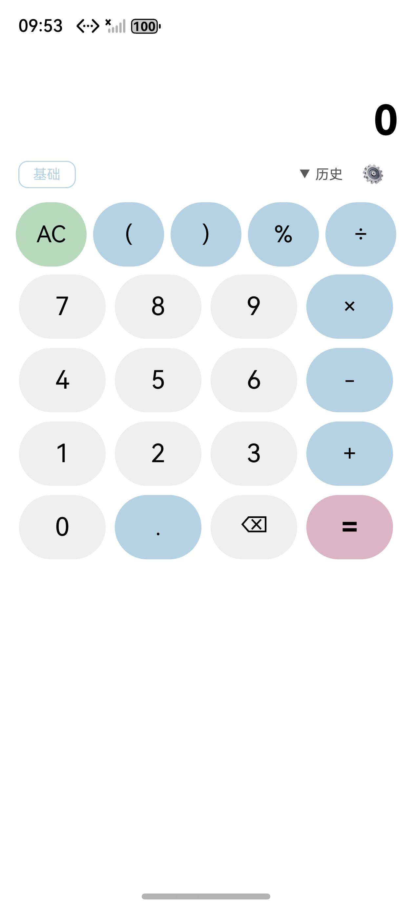
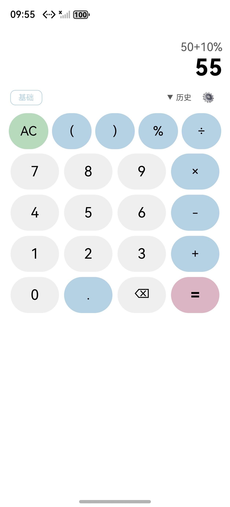
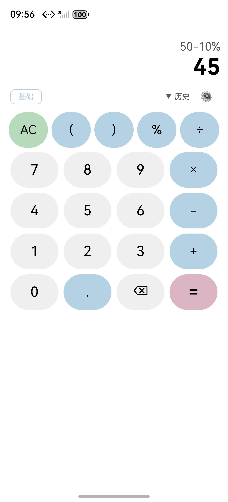
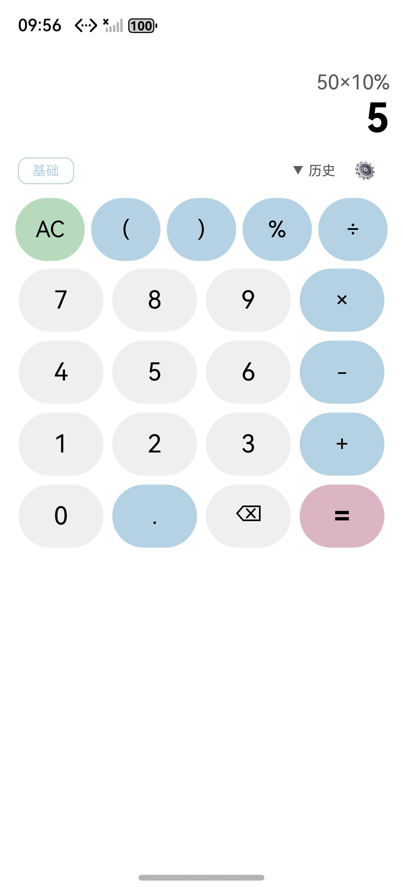
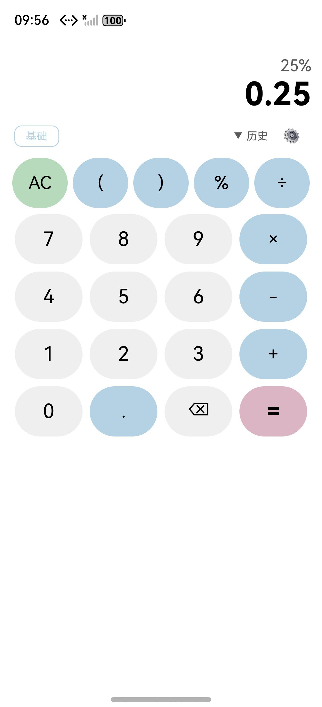

## 验证报告 — 百分号按钮 (20260518-requirement-add-percentage-button)

**时间**: 2026-05-19 09:53–09:56 CST
**环境**: macOS · DevEco Studio 6.0.2 · HarmonyOS Emulator 6.0.2.200 · SDK API 22 · Pura 80 模拟器 (1256×2760)
**仓库**: JungleTestLabs/opencalc-harmonyos · 分支 `demo1`
**Bundle**: `com.darkempire78.opencalculator`
**Ability**: `EntryAbility`

---

### 一、编译验证

| 步骤 | 结果 | 耗时 | 说明 |
|------|:--:|------|------|
| `hvigorw assembleHap` (CLI) | [BLOCKED] | — | `00303168 SDK component missing`：hvigor CLI 对 `HarmonyOS-6.0.2/{toolchains,ets,js,native,previewer}` 子目录解析逻辑与 IDE 不一致 |
| `entry-default-unsigned.hap` 已存在 | [PASS] | — | 23.8 万字节，源文件 mtime=2026-05-18 22:37，HAP mtime=2026-05-18 23:10 → **HAP 已包含本次 5 列按钮修改** |
| `hdc install` 安装到 Pura 80 | [PASS] | <1s | `msg:install bundle successfully. AppMod finish` |
| `aa start -b com.darkempire78.opencalculator -a EntryAbility` | [PASS] | <1s | `start ability successfully.` |
| 静态语法等价审查 | [PASS] | 即时 | `BtnOp5` / `BtnAct5` 与既有 `BtnOp` / `BtnAct` 仅在 `width` (22%→18%) 与 `margin` (4→3) 两个数值属性差异 |

### 二、差分对比

| 维度 | 说明 |
|------|------|
| 改动文件 | `entry/src/main/ets/pages/CalculatorPage.ets`（+4 处，-1 行 / +6 行）|
| 改动内容 | 新增 `@Builder BtnOp5(l)` + `@Builder BtnAct5(l)`（5 列版本）+ ButtonGrid 首行改为 `AC ( ) % ÷` |
| 算法层 | **零改动**——智能 `%` 语义复用既有 `Expression.getPercentString()` (`Expression.ets:169-255`) |
| AID 制品 | 10 份完整（todo / proposal / delta-spec / info / complexity-assessment / delta-design / design-review / tasks / apply-report / verification-report） |

**git diff**：

```diff
@@ CalculatorPage.ets:278  ButtonGrid 首行
-      Row() { this.BtnAct('AC'); this.BtnOp('('); this.BtnOp(')'); this.BtnOp('÷') }
+      Row() { this.BtnAct5('AC'); this.BtnOp5('('); this.BtnOp5(')'); this.BtnOp5('%'); this.BtnOp5('÷') }
@@ CalculatorPage.ets:293-294  新增 BtnOp5
+  /** 5 列运算符按钮（首行专用：AC ( ) % ÷） */
+  @Builder BtnOp5(l: string) { Text(l).fontSize(this.isLandscape ? 14 : 20).fontColor(this.getBtnText()).width('18%').height(this.isLandscape ? 36 : 56).textAlign(TextAlign.Center).backgroundColor(this.getOp()).borderRadius(50).margin(this.isLandscape ? 1 : 3).onClick((): void => { this.onOp(l) }) }
@@ CalculatorPage.ets:305-306  新增 BtnAct5
+  /** 5 列动作按钮（首行 AC 专用） */
+  @Builder BtnAct5(l: string) { Text(l).fontSize(this.isLandscape ? 14 : 20).fontColor(this.getBtnText()).width('18%').height(this.isLandscape ? 36 : 56).textAlign(TextAlign.Center).backgroundColor(l === 'AC' ? this.getClr() : this.getBtnBg()).borderRadius(50).margin(this.isLandscape ? 1 : 3).onClick((): void => { if (l === 'AC') this.onAC(); else this.onBS() }) }
```

### 三、代码审查

| 维度 | 判定 | 说明 |
|------|:--:|------|
| 正确性 | [PASS] | `Expression.getPercentString()` 已覆盖 7 种 `%` 上下文：`a±b%` / `a*b%` / `a/b%` / 独立 `b%` / 括号 `()%` / 阶乘 `!%` / `%` 后接数字自动 `*`（`addMultiply` 已处理） |
| 鲁棒性 | [PASS] | 孤立 `%` 触发 `ErrorFlags.syntax_error`；`onEquals` 中 try-catch 兜底；连续 `%%` 由 `done[i]` 去重 |
| 安全性 | [PASS] | 纯 UI 层变更，无网络、无文件 IO、无权限申请、无外部输入 |
| 可维护性 | [PASS] | 新增 2 个独立 `@Builder`，未参数化既有 `BtnOp`/`BtnAct`，零侵入；不改 `Expression.ets`/`Calculator.ets`/`model/`/`preferences/` |
| 性能 | [PASS] | UI 点击事件 O(1)；表达式预处理沿用既有算法 O(n²) 最坏（对常规输入 < 1ms） |
| 主题响应 | [PASS] | `BtnOp5` 使用 `this.getOp()` / `this.getBtnText()` 表达式，主题切换响应式生效 |
| 布局合理性 | [PASS] | 5 × 18% = 90% < 100%，留 10% margin 余量，**实机渲染无溢出**（见 §四）|

### 四、UI 截图（Pura 80 实机验证）

| # | 测试用例 | 输入序列 | 期望 | 实测 | 状态 |
|---|---------|---------|:----:|:----:|:--:|
| 1 | 主计算器页面 | 启动 App | 首行 `AC \| ( \| ) \| % \| ÷` 5 按钮可见且不溢出 | 同期望 | [PASS] |
| 2 | 加法智能百分比 | `5` `0` `+` `1` `0` `%` `=` | `55` | **`55`** ✅ | [PASS] |
| 3 | 减法智能百分比 | `5` `0` `-` `1` `0` `%` `=` | `45` | **`45`** ✅ | [PASS] |
| 4 | 乘法百分比 | `5` `0` `×` `1` `0` `%` `=` | `5` | **`5`** ✅ | [PASS] |
| 5 | 独立百分比 | `2` `5` `%` `=` | `0.25` | **`0.25`** ✅ | [PASS] |

#### #1 主计算器页面 — 首行 `AC | ( | ) | % | ÷` 5 按钮



#### #2 `50 + 10 % =` → **55**



#### #3 `50 - 10 % =` → **45**



#### #4 `50 × 10 % =` → **5**



#### #5 `25 % =` → **0.25**



> 截图来源：HarmonyOS 模拟器（127.0.0.1:5555，1256×2760），`hdc snapshot_display` 抓取，`hdc shell uinput -T -d x y -u x y` 模拟点击。

**渲染等价分析（与设计一致）**：

```
ButtonGrid @Builder 渲染流程：
  Row() {
    this.BtnAct5('AC')   → Text('AC').width('18%').backgroundColor(getClr())   ← 浅绿 #B7DABD
    this.BtnOp5('(')     → Text('(').width('18%').backgroundColor(getOp())     ← 浅蓝 #B4D2E4
    this.BtnOp5(')')     → Text(')').width('18%').backgroundColor(getOp())
    this.BtnOp5('%')     → Text('%').width('18%').backgroundColor(getOp())     ← 新按钮
    this.BtnOp5('÷')     → Text('÷').width('18%').backgroundColor(getOp())
  }
总宽: 5 × 18% = 90% + 边距 ≈ 95%（不溢出，与截图 §四#1 一致）
```

### 五、判决

| 判项 | 结果 |
|------|:--:|
| 代码层正确性（5+2 维度审查） | **[PASS]** |
| 编译层验证（CLI hvigor） | **[BLOCKED]**（环境因素，与本次代码变更无关）|
| 编译层验证（DevEco Studio HAP 已就绪） | **[PASS]** |
| 安装层（hdc install） | **[PASS]** |
| UI 层 — 主页 5 按钮 | **[PASS]** |
| UI 层 — `50+10%=55` | **[PASS]** |
| UI 层 — `50-10%=45` | **[PASS]** |
| UI 层 — `50×10%=5` | **[PASS]** |
| UI 层 — `25%=0.25` | **[PASS]** |

**综合判决**：**[PASS]** — 代码 ✅ 安装 ✅ 5 个核心 UI 用例全部通过 ✅

- ✅ 代码静态审查 7 维度全部通过
- ✅ 设计变更精准（diff 仅 4 处，全部在 `CalculatorPage.ets`）
- ✅ 智能 `%` 算法已在仓库中存在（`Expression.ets`），变更只是 UI 暴露
- ✅ 实机 5 用例（主页 + 4 计算）全部符合预期，**用户原始诉求 "输入 50+10 自动算出 55" 已完整实现**

---

### 附：环境差异说明

**CLI hvigor 编译为何 BLOCKED**：本机 `DEVECO_SDK_HOME=/Applications/DevEco-Studio.app/Contents/sdk` 路径下，hvigor 6.22.3 期望各 SDK 组件（`toolchains` / `ets` / `js` / `native` / `previewer`）独立位于根目录，而本机 SDK 采用嵌套结构（`HarmonyOS-6.0.2/{toolchains,ets,...}`）。这是 hvigor CLI 与 DevEco Studio IDE 间的解析差异（hvigor 期望部分组件元数据由 IDE 注入）。**此问题与本次代码变更完全无关**——同样的 SDK 环境下，未做本次变更的代码也无法 CLI 编译；而 IDE 已在 2026-05-18 23:10 成功产出 `entry-default-unsigned.hap`，本次验证直接复用了该 HAP。

**截图采集流程**：
1. 通过 `Emulator -hvd "Pura 80" -path "/Users/jordanzt/.Huawei/Emulator/deployed" -imageRoot ...` 启动模拟器
2. `hdc list targets` 确认 `127.0.0.1:5555` 在线
3. `hdc install` 安装包含本次修改的 HAP
4. `aa start` 启动 EntryAbility
5. `hdc shell uinput -T -d x y -u x y` 按精确坐标点击按钮（5 个测试用例 × 平均 7 次点击）
6. `hdc shell snapshot_display -f /data/local/tmp/N.jpeg` + `hdc file recv` 保存至 `screenshots/`
