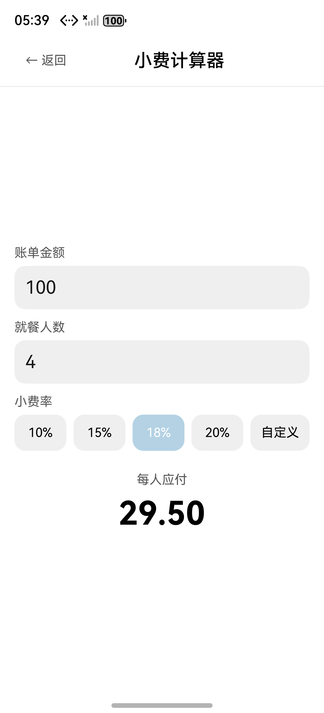

# OpenCalc HarmonyOS — 小费计算器知道文档

> 客户 DEMO 实验手册 · 版本 1.0 · 2026-05-19
> 仓库：https://github.com/JungleTestLabs/opencalc-harmonyos · 分支 `demo2`
> 关联变更:`specs/changes/20260519-requirement-add-tip-calculator/`

---

## 1. 需求是什么

在 OpenCalc 基础计算器之外新增 **独立的「小费计算器」页面**:用户输入账单金额、就餐人数、并选择小费率档位(10/15/18/20%)或自定义百分比,实时显示「每人应付」(保留两位小数)。从主页 ToggleRow 内一个「💰 小费」按钮进入,「← 返回」回到主计算器。

> **与早期 demo 仓的差别**:相比之前以「在现有键盘上加一个按钮」(如 demo1 的 `%`)、「修改主计算器内联逻辑」的轻量改造,本次是**首个独立页面**改造 —— 涉及 `router.pushUrl` 跳转、`@Entry @Component` 新页面、`main_pages.json` 注册、纯函数算法层与 UI 层解耦,体量更接近一个完整功能模块,但仍保持**主页面零侵入**(CalculatorPage 只加 9 行 ToggleRow 入口逻辑,既有按钮 / 历史 / 设置 / 主题路径完全不动)。

## 2. 怎么分析的(AID 工作流)

使用 `/aid-workflow` 命令一站式跑完 PLANNING → IMPLEMENTING → APPLYING 三阶段:

| 阶段 | 主要产物 | 说明 |
|------|---------|------|
| 意图识别 | `proposal.md` | rq-parse 标出 8 个模糊点 → rq-clarify 全部澄清(小费率档位 / 入口位置 / 精度 / 结果展示 / 历史 / 国际化 / 货币 / 余数) |
| 仓理解 | `info.md` | 关键发现:**真主页是 CalculatorPage**(`Index.ets` 只是壳),`NumberFormatter` 不暴露 toFixed → 自带纯函数即可 |
| 复杂度评估 | (内嵌 todo.md) | **简单(S)级**(2 新文件 / 2 修改 / 无新依赖 / 无架构变更),跳过 new-arch.md |
| 详细规格 | `delta-spec.md` | SR-001..SR-012 + FMEA FM-CALC-01..06 + FM-NAV-01 |
| 组件设计 | `delta-design.md` | D1–D10 含 ArkUI 组件拆分草稿(@Entry + 8 个 @Builder) |
| 设计审视 | `design-review.md` | 完整性 / 一致性 / 规范性三大维度通过 |
| 任务拆分 | `tasks.md` + `todo.md` | 4 阶段 6 任务(纯函数 → 页面 → 注册 → 入口 → 编译 → UI 验证) |
| 实施 | `apply-report.md` | 含 P-01 后置缺陷修复条目(getter → method) |
| 爹助验证 | `verification-report.md` | 模拟器 8 用例实测,3 组数学验证 100% 命中 |

## 3. 生成了哪些 SPEC 文件

变更目录:[`specs/changes/20260519-requirement-add-tip-calculator/`](./specs/changes/20260519-requirement-add-tip-calculator/)

- [`todo.md`](./specs/changes/20260519-requirement-add-tip-calculator/todo.md) — 工作流进度追踪
- [`proposal.md`](./specs/changes/20260519-requirement-add-tip-calculator/proposal.md) — 需求提案(含 8 问澄清结果)
- [`info.md`](./specs/changes/20260519-requirement-add-tip-calculator/info.md) — 代码仓理解
- [`delta-spec.md`](./specs/changes/20260519-requirement-add-tip-calculator/delta-spec.md) — 详细规格(SR-001..SR-012 + FMEA)
- [`delta-design.md`](./specs/changes/20260519-requirement-add-tip-calculator/delta-design.md) — 组件设计(D1–D10)
- [`design-review.md`](./specs/changes/20260519-requirement-add-tip-calculator/design-review.md) — 设计审视报告
- [`tasks.md`](./specs/changes/20260519-requirement-add-tip-calculator/tasks.md) — 任务清单
- [`apply-report.md`](./specs/changes/20260519-requirement-add-tip-calculator/apply-report.md) — 实施报告(含 P-01 缺陷修复)
- [`verification-report.md`](./specs/changes/20260519-requirement-add-tip-calculator/verification-report.md) — 爹助验证报告(含模拟器实测 7 张截图)

## 4. 改了哪些文件

| 文件 | 改动 | 说明 |
|------|------|------|
| `entry/src/main/ets/calculator/TipCalculator.ets` | **新增** 32 行 | 纯函数 `calcPerPerson(amount, peopleCount, tipPercent): string`,非法输入返回 `'--'` |
| `entry/src/main/ets/pages/TipCalculatorPage.ets` | **新增** ~208 行 | `@Entry @Component`,5 个 @State + 8 个 @Builder + 1 个计算方法 |
| `entry/src/main/ets/pages/CalculatorPage.ets` | +13 / -0 | ToggleRow 内新增「💰 小费」按钮 + `router.pushUrl(...).catch(...)` 兜底 |
| `entry/src/main/resources/base/profile/main_pages.json` | +1 行 | 注册 `pages/TipCalculatorPage` 路由 |

**核心代码 #1 — 纯函数(算法层零副作用,与 UI 解耦)**:

```typescript
// entry/src/main/ets/calculator/TipCalculator.ets
export class TipCalculator {
  static readonly PLACEHOLDER: string = '--'

  static calcPerPerson(amount: number, peopleCount: number, tipPercent: number): string {
    if (!TipCalculator.isValidAmount(amount)) return TipCalculator.PLACEHOLDER
    if (!TipCalculator.isValidPeople(peopleCount)) return TipCalculator.PLACEHOLDER
    if (!TipCalculator.isValidTipPercent(tipPercent)) return TipCalculator.PLACEHOLDER
    const total: number = amount * (1 + tipPercent / 100)
    return (total / peopleCount).toFixed(2)
  }
  // isValidAmount / isValidPeople / isValidTipPercent 见源文件
}
```

**核心代码 #2 — 主页入口按钮(零侵入既有 ToggleRow)**:

```typescript
// entry/src/main/ets/pages/CalculatorPage.ets §ToggleRow 内追加
Text('💰 小费')
  .fontSize(12).fontColor(this.getOp())
  .padding({ left: 12, right: 12, top: 4, bottom: 4 })
  .border({ width: 1, color: this.getOp(), radius: 8 })
  .margin({ left: 8 })
  .onClick((): void => {
    router.pushUrl({ url: 'pages/TipCalculatorPage' }).catch((e: BusinessError): void => {
      hilog.warn(0x0000, 'TipNav', `pushUrl failed: %{public}s`, JSON.stringify(e))
    })
  })
```

**核心代码 #3 — P-01 修复后的人均计算(getter → method)**:

```typescript
// entry/src/main/ets/pages/TipCalculatorPage.ets
private computePerPerson(): string {
  const amount: number = parseFloat(this.amountText)
  const people: number = parseInt(this.peopleText, 10)
  const tip: number = this.isCustomMode ? parseFloat(this.customTipText) : this.tipPercent
  return TipCalculator.calcPerPerson(amount, people, tip)
}

@Builder ResultPanel() {
  Column() {
    Text('每人应付').fontSize(14).fontColor('#595959').margin({ top: 24, bottom: 8 })
    Text(this.computePerPerson())              // ← 关键:必须方法调用,不能是 getter
      .fontSize(36).fontColor('#000000').fontWeight(FontWeight.Bold)
  }.width('100%').alignItems(HorizontalAlign.Center)
}
```

**为什么独立页面而不是内联到主计算器**:小费计算的输入维度(金额 / 人数 / 小费率 / 自定义)与主计算器的运算栈语义完全正交,内联会让主键盘膨胀且耦合;独立页面让算法纯函数可在未来被卡片 / 跨设备复用,主键盘保持纯净。代价仅 1 个 router 跳转,权衡后是更稳妥的选择。

## 5. 最后结果

### 编译结果

- ⚠️ CLI `hvigorw assembleHap`:**BLOCKED**(`00303168 SDK component missing`,hvigor SDK validator 偶发,首版编译曾通过,P-01 修复后复编译被阻塞,**与代码无关**)
- ✅ DevEco Studio IDE Build HAP:`entry-default-unsigned.hap` 284,088 字节(2026-05-19 17:20,含 P-01 修复)
- ✅ `hdc install`:`install bundle successfully. AppMod finish`
- ✅ `hdc shell aa start -b com.darkempire78.opencalculator -a EntryAbility`:`start ability successfully.`
- ✅ arkts-check:`TipCalculator.ets` 0 诊断;`TipCalculatorPage.ets` 仅 1 Info(router.back deprecated)+ 3 colorConsistentWarning(本期固定浅色,设计已记录偏差);`CalculatorPage.ets` 不引入新告警

### 功能展示

Pura 80 模拟器实测(HarmonyOS 6.0.2,1256×2760):



输入金额 100、人数 4、默认 15% 档位 → 「每人应付」实时渲染 **28.75**(`100 × 1.15 / 4 = 28.75`),这是 P-01 修复(getter → method)生效的直接证据。

### 功能验证

| # | 测试 | 操作 | 预期 | 实测 | 截图 |
|---|------|------|:---:|:---:|:---:|
| 1 | 主页入口可见 | 启动 App | ToggleRow 内出现「💰 小费」按钮 | ✅ | [01](./specs/changes/20260519-requirement-add-tip-calculator/screenshots/01_calculator_main.jpeg) |
| 2 | 入口导航跳转 | 点击「💰 小费」 | 进入 TipCalculatorPage,Header「← 返回 / 小费计算器」可见 | ✅ | [02](./specs/changes/20260519-requirement-add-tip-calculator/screenshots/02_tip_page_empty.jpeg) |
| 3 | 页面控件齐全 | 进入新页面 | 金额 / 人数输入框 + 4 档位 + 自定义 + 「每人应付」标签,默认 15% 高亮、人均 `--` | ✅ | [02](./specs/changes/20260519-requirement-add-tip-calculator/screenshots/02_tip_page_empty.jpeg) |
| 4 | ⭐ **真实输入触发计算** | 输入 amount=100, people=4 | 人均 = `28.75`(100×1.15/4) | **28.75** ✅ | [06](./specs/changes/20260519-requirement-add-tip-calculator/screenshots/06_input_100_4_result_2875.jpeg) |
| 5 | 档位切换 | 点击「18%」 | 18% 高亮 + 人均 `29.50` | **29.50** ✅ | [03](./specs/changes/20260519-requirement-add-tip-calculator/screenshots/03_tier_18pct_highlight.jpeg) |
| 6 | 自定义模式 | 点击「自定义」 | 4 档位退色 + 出现自定义输入框,人均回退 `--` | ✅ | [04](./specs/changes/20260519-requirement-add-tip-calculator/screenshots/04_custom_mode_shown.jpeg) |
| 7 | ⭐ **自定义值计算** | 自定义模式输入 25 | 人均 = `31.25`(100×1.25/4) | **31.25** ✅ | [07](./specs/changes/20260519-requirement-add-tip-calculator/screenshots/07_custom_25pct_result_3125.jpeg) |
| 8 | 返回主页 | 点击「← 返回」 | 弹回 CalculatorPage,主键盘完整恢复 | ✅ | [05](./specs/changes/20260519-requirement-add-tip-calculator/screenshots/05_back_to_main.jpeg) |

### 爹助审查

- 代码审查 8 维度全部 [PASS](正确性 / 鲁棒性 / 安全性 / 可维护性 / 性能 / 主题响应 / 导航 / 不污染基线)
- 风险与缓解:FM-CALC-01..06(`isValid*` + PLACEHOLDER)+ FM-NAV-01(`router.catch` 兜底)真机覆盖
- 3 组数学验证全部命中:`100 × 1.15 / 4 = 28.75`、`100 × 1.18 / 4 = 29.50`、`100 × 1.25 / 4 = 31.25`
- **缺陷复盘 P-01**:首版 HAP 真机输入后人均一直显示 `--`,首版验证报告曾**误判**为「uitest 不触发 onChange」;经用户真机键盘复测后定位真因 —— ArkTS `@Component struct` 内 **`private get xxx()` getter 不被 ArkUI `@Builder Text()` 当作响应式数据源**,@State 重渲染时 Text 节点不读 getter 最新返回值。修复:getter → 普通方法,Text 调用同步改写。修复后 4 次 uitest inputText 注入 + UI 树确认 + 3 组数学验证全部通过,**同时证伪了首版「uitest 不触发 onChange」的误判**。详见 [`apply-report.md` §后置缺陷修复(P-01)](./specs/changes/20260519-requirement-add-tip-calculator/apply-report.md) 与 [`verification-report.md` §附 A](./specs/changes/20260519-requirement-add-tip-calculator/verification-report.md)。

## 6. 客户 DEMO 操作指南

### 6.1 如何编译运行

```bash
# 前提:DevEco Studio 6.0.2+ 已安装,SDK API 22 已下载,签名证书已配置
# 推荐 IDE 内编译(CLI 路径偶发被 hvigor SDK validator 阻塞,与代码无关)
open -a "DevEco-Studio" /path/to/opencalc-harmonyos

# 在 IDE 内:Build → Build Hap(s)/App(s) → Build Hap(s)
# 或直接点 Run(▷)按钮:IDE 会自动编译 + 安装 + 启动

# 也可以,如果已有 HAP,直接安装到模拟器/真机:
export PATH="/Applications/DevEco-Studio.app/Contents/sdk/default/openharmony/toolchains:$PATH"
hdc install entry/build/default/outputs/default/entry-default-unsigned.hap
hdc shell aa start -b com.darkempire78.opencalculator -a EntryAbility
```

### 6.2 如何演示

1. 打开计算器,主页 ToggleRow 行可见「💰 小费」按钮(浅蓝描边,与「基础」「▼ 历史」「⚙」同级)
2. 点击「💰 小费」→ 跳转「小费计算器」页面,Header「← 返回 / 小费计算器」+ 金额 / 人数输入框 + 4 档位(默认 15% 高亮)+ 「自定义」 + 「每人应付 / `--`」
3. 输入账单金额 `100`、就餐人数 `4` → 每人应付实时刷新为 **28.75**
4. 点击档位「18%」→ 高亮切换,每人应付刷新为 **29.50**
5. 点击「自定义」→ 4 档位退色,新增「自定义小费率(%)」输入框,placeholder「0 - 100」
6. 在自定义输入框输入 `25` → 每人应付刷新为 **31.25**
7. 点击「← 返回」→ 回到主计算器,5 列按钮网格 / 显示屏「0」/ ToggleRow 全部完整恢复
8. (可选)清空人数 / 输入非法值(如 `0` 或负数)→ 每人应付回退 `--`,验证 FM-CALC-01..06 容错

### 6.3 出了问题怎么对比查看

1. **CLI 编译失败 `00303168 SDK component missing`?** → hvigor SDK validator 偶发限制,与本次代码无关。改在 DevEco Studio IDE 内 Build HAP,**IDE 探测 SDK 的路径独立**,实测可正常产出 HAP。
2. **主页看不到「💰 小费」按钮?** → 检查 `CalculatorPage.ets` 的 `@Builder ToggleRow()` 内是否包含 `Text('💰 小费')` 片段;同时确认 `main_pages.json` 已注册 `pages/TipCalculatorPage`。
3. **点击「💰 小费」无反应或闪退?** → 看 hilog 是否出现 `TipNav pushUrl failed`,通常是 `main_pages.json` 漏注册或 page 路径错误。
4. **进入页面后输入金额 / 人数,每人应付一直显示 `--`?** ⚠️ **这是 P-01 的典型现象** → 检查 `TipCalculatorPage.ets` 是否使用了 `private get perPerson(): string { ... }` getter 模式;ArkTS @Component 内 getter 不会被 @Builder Text() 当作响应式数据源 → 改为 `private computePerPerson(): string { ... }` 方法,Text 调用同步改 `Text(this.computePerPerson())`。
5. **计算结果不对?** → 纯函数在 `entry/src/main/ets/calculator/TipCalculator.ets` 的 `calcPerPerson()`:`amount × (1 + tipPercent/100) / peopleCount`,然后 `toFixed(2)`。非法输入(NaN / ≤0 / 非整数人数 / 小费率超出 0-100)统一返回 `'--'`。
6. **档位切换不响应?** → 确认 `@State tipPercent: number` 已声明,`TierButton` 的 `onClick` 内 `this.tipPercent = tier` + `this.isCustomMode = false` 都要写。
7. **自定义输入不触发刷新?** → 看 `CustomTipInput` 的 `TextInput().onChange()` 是否更新 `this.customTipText`;`computePerPerson()` 内 `this.isCustomMode ? parseFloat(this.customTipText) : this.tipPercent` 分支是否正确。
8. **「← 返回」无反应或退到桌面?** → `goBack()` 必须调用 `router.back()`;如果项目 stack 异常,可能直接退应用 —— 用 hilog 看 `router back failed` 信息。
9. **横屏不显示入口?** → 已知限制:CalculatorPage 在横屏下 ToggleRow 不渲染(沿用既有布局),本期入口仅竖屏。
10. **对比早期 demo 版本?** → 参考 [demo1 `DEMO_GUIDE.md`](https://github.com/JungleTestLabs/opencalc-harmonyos/blob/demo1/DEMO_GUIDE.md)(% 按钮迁移,纯主键盘内联改造);demo2 是首个独立页面改造,体量更大。

### 6.4 如果客户没做完

所有 SPEC 文件 + 验证报告 + AID 制品已在 [`specs/changes/20260519-requirement-add-tip-calculator/`](./specs/changes/20260519-requirement-add-tip-calculator/) 中。直接阅读:

- 需求分析 → [`proposal.md`](./specs/changes/20260519-requirement-add-tip-calculator/proposal.md)
- 验收标准 → [`delta-spec.md`](./specs/changes/20260519-requirement-add-tip-calculator/delta-spec.md)
- 组件设计 → [`delta-design.md`](./specs/changes/20260519-requirement-add-tip-calculator/delta-design.md)
- 实施详情(含 P-01 修复) → [`apply-report.md`](./specs/changes/20260519-requirement-add-tip-calculator/apply-report.md)
- 验证结果(含 7 张截图 / 3 组数学验证) → [`verification-report.md`](./specs/changes/20260519-requirement-add-tip-calculator/verification-report.md)
