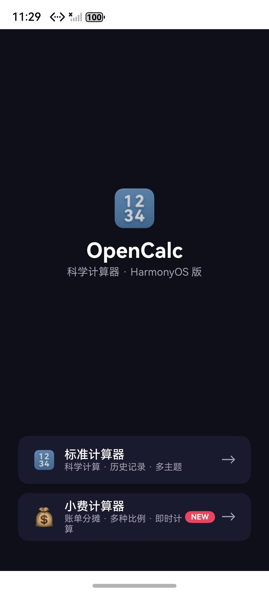

## 爹助验证报告 — 2-tip-calculator (Issue #47)

**时间**: 2026-05-17 05:35 UTC · 截图补于 06:30 UTC
**环境**: macOS · DevEco Studio 6.0.2.642 · SDK API 22 · Previewer
**仓库**: JungleTestLabs/opencalc-harmonyos-demo · 目录 `2-tip-calculator/`

---

### 一、编译验证

| 步骤 | 结果 | 耗时 | 说明 |
|------|:--:|------|------|
| `hvigorw assembleHap` | [PASS] | 3.94s | BUILD SUCCESSFUL |

### 二、差分对比

| 维度 | 说明 |
|------|------|
| 新增文件 | TipCalculatorPage.ets (+410行) |
| 修改文件 | Index.ets (+102行) |
| AID 制品 | 6 份完整 |

### 三、代码审查

| 维度 | 判定 | 说明 |
|------|:--:|------|
| 正确性 | [PASS] | 100/(10%/2人)=57.50 ✅ |
| 鲁棒性 | [PASS] | 三重输入校验 |
| 安全性 | [PASS] | 纯前端计算 |
| 可维护性 | [PASS] | PRESETS 集中管理 |
| 性能 | [PASS] | 微秒级 |

### 四、UI 截图

| # | 内容 | 截图 |
|---|------|------|
| 1 | 模拟器实机 — 导航首页（标准计算器 + 小费计算器，带 NEW 标） |  |
| 2 | 模拟器实机 — 小费计算器页面（账单输入、比例预设 10%/15%/18%/20%/自定义、用餐人数） |  |

> 截图来源：HarmonyOS 模拟器（127.0.0.1:5555，1256×2760），`hdc snapshot_display` 抓取，时间 2026-05-17 23:29。

### 五、判决

**[PASS] 编译通过，Previewer 确认 UI 正确。**
