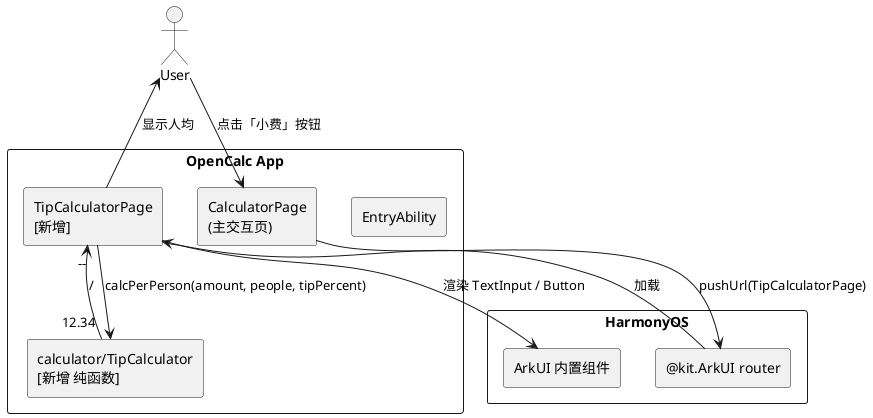
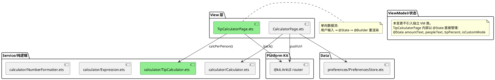
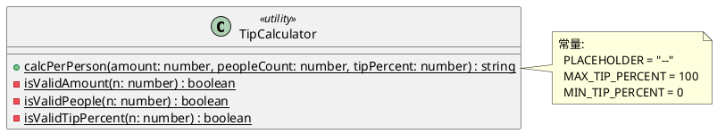
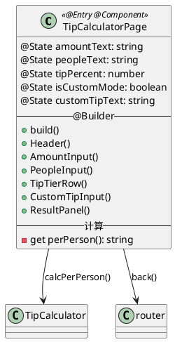
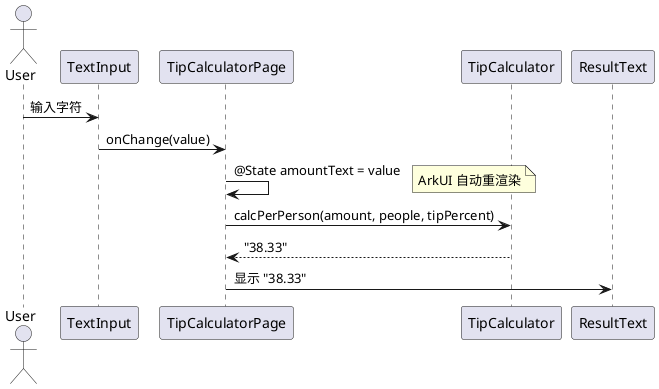
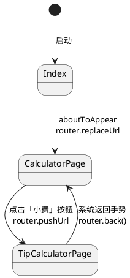

# 小费计算器 增量设计 (delta-design.md)

> 本文件为本次变更(20260519-requirement-add-tip-calculator)的增量设计。由于项目暂无独立 `design.md` 基线,本文件仅描述与本变更相关的设计决策,并显式引用 `entry/src/main/ets/` 的现有代码作为基线。

## 1. 概述

### 1.1 应用定位
为 OpenCalc HarmonyOS 应用新增一个独立的小费计算器子页面。功能:用户输入账单金额、就餐人数,选择(或自定义)小费率,实时得到每人应付金额。

### 1.2 核心交互
```
用户 → CalculatorPage(主交互页) → 点击 ToggleRow 中「小费」按钮
     → TipCalculatorPage(新页面)
       → 输入金额 / 输入人数 / 选档位或自定义
       → 实时显示「每人应付」(两位小数,非法时显示 "--")
     → 系统返回手势 → 回到 CalculatorPage
```

### 1.3 技术栈概览
- 框架: ArkTS + Stage 模型 + ArkUI 声明式
- 状态管理: **V1** (`@State` / `@Entry @Component`),与 `CalculatorPage.ets` 现有风格一致
- 使用的 Kit:
  - `@kit.ArkUI` 的 `router` (新页面跳转)
  - ArkUI 内置组件(TextInput/Button/Text/Row/Column)
- Hvigor: 沿用现有 `build-profile.json5`,无配置修改
- API version: HarmonyOS 6.0.0(14)
- 无 Native(C++/Rust)模块

---

## 2. 功能清单

| 功能名 | 说明 | 入口 Ability/Page | 优先级 |
|--------|------|-------------------|--------|
| 入口按钮 | CalculatorPage ToggleRow 新增「小费」按钮 | EntryAbility / CalculatorPage | P0 |
| 小费计算器页面 | 输入金额/人数/小费率,显示人均 | EntryAbility / TipCalculatorPage | P0 |
| 小费率预设档位 | 10/15/18/20% 4 个档位,默认 15% | TipCalculatorPage | P0 |
| 小费率自定义输入 | 0-100 数字输入,与档位互斥 | TipCalculatorPage | P1 |
| 实时计算 | 输入变化 100ms 内刷新人均 | TipCalculatorPage | P0 |
| 输入容错 | 非法输入显示 `--`,UI 不崩溃 | TipCalculatorPage / TipCalculator | P0 |
| 返回交互 | 系统返回手势回到 CalculatorPage | TipCalculatorPage | P0 |

---

## 3. 实现模型

### 3.1 上下文视图



### 3.2 总体架构



绿色组件为本变更新增,其余为现有。

### 3.3 HAP/HAR/HSP 模块划分
本变更仅修改 `entry` HAP,不引入新模块。

| 模块 | 类型 | 本变更影响 |
| --- | --- | --- |
| `entry` | HAP(入口) | 新增 2 个文件 + 修改 2 个文件 |

### 3.4 设计系统规格

#### 3.4.1 色彩系统
仅使用浅色一组(本期不接入主题切换,沿用 CalculatorPage 默认浅色取值)。

| 名称 | 值 | 用途 |
| --- | --- | --- |
| color.bg | `#FFFFFF` | 页面背景 |
| color.input.bg | `#EFEFEF` | TextInput 背景 |
| color.tier.normal | `#EFEFEF` | 未选中档位按钮背景 |
| color.tier.selected | `#B4D2E4` | 选中档位按钮背景(同现有运算符蓝) |
| color.text.primary | `#000000` | 主文字 |
| color.text.secondary | `#595959` | 次文字/占位 |
| color.text.result | `#000000` | 人均结果文字 |
| color.divider | `#E8E8E8` | 分割线 |
| color.button.back | `#B7DABD` | 返回按钮(同现有 AC 浅绿) |

#### 3.4.2 主题系统
本期不接入。**已知偏差**:用户在 CalculatorPage 切到暗色/AMOLED 后进入本页面仍为浅色。记录在 design-review 的 R-04。

#### 3.4.3 排版系统

| 名称 | 字号 | 用途 |
| --- | --- | --- |
| ts.title | 20 | 页头标题「小费计算器」 |
| ts.label | 14 | 输入项标签(金额/人数/小费率) |
| ts.input | 20 | TextInput 内容 |
| ts.tier | 14 | 档位按钮文字 |
| ts.result.label | 14 | "每人应付" 标签 |
| ts.result.value | 36 | 人均数值 |

#### 3.4.4 间距与尺寸系统

| 名称 | 值 | 用途 |
| --- | --- | --- |
| sp.page.padding | 16 | 页面外边距 |
| sp.section.gap | 16 | 区段之间垂直间距 |
| sp.row.gap | 8 | 行内元素水平间距 |
| sz.input.height | 48 | TextInput 高度 |
| sz.tier.height | 40 | 档位按钮高度 |
| sz.tier.minWidth | 56 | 档位按钮最小宽度 |
| sz.btn.radius | 12 | 输入与按钮圆角 |

#### 3.4.5 图标与图形资源
本变更不新增图标资源。入口按钮采用文字 + emoji "💰 小费"或纯文字「小费」(参考 CalculatorPage 同行的"⚙"/"▼ 历史")。

#### 3.4.6 动画规格
本变更不使用动画。结果变化通过 ArkUI 内置的 @State 重渲染呈现,无显式过渡。

#### 3.4.7 响应式断点与栅格
- 竖屏(`w ≤ h`): 默认布局,Column 纵向排列,本页支持。
- 横屏(`w > h`): 本期不提供入口(ToggleRow 在横屏不显示),本页面进入后采用 Column 自适应,内容居中,**已知限制**:用户进入横屏页面后体验不优,记录在 design-review 的 R-04/Limitation。

### 3.5 TipCalculator 模块(纯函数)

#### 3.5.1 模块介绍
纯函数计算工具,负责"含小费人均"的核心计算。无副作用、无状态、不依赖 ArkUI。

#### 3.5.2 功能描述
- 接收三个数字输入(金额、人数、小费率)。
- 处理 NaN/空/0/负数等异常输入。
- 返回字符串(已格式化为两位小数,或 `"--"`)。

#### 3.5.3 目录结构
```
entry/src/main/ets/calculator/
├── Calculator.ets         # 现有
├── Expression.ets         # 现有
├── NumberFormatter.ets    # 现有
└── TipCalculator.ets      # [新增] 本次产出
```

#### 3.5.4 架构图谱



#### 3.5.5 功能与用例分析

```
用例 U1: 正常计算
前置: amount=100, people=3, tipPercent=15
步骤:
  1. 校验三个参数合法
  2. total = 100 * (1 + 15/100) = 115
  3. perPerson = 115 / 3 = 38.3333...
  4. 调用 .toFixed(2) → "38.33"
后置: 返回 "38.33"

用例 U2: 人数为 0
前置: amount=100, people=0, tipPercent=15
步骤:
  1. isValidPeople(0) === false
  2. 返回 PLACEHOLDER
后置: 返回 "--"

用例 U3: 金额为 NaN
前置: amount=NaN
步骤:
  1. isValidAmount(NaN) === false
  2. 返回 PLACEHOLDER
后置: 返回 "--"

用例 U4: 小费率边界
前置: amount=100, people=2, tipPercent=0
后置: 返回 "50.00"

前置: amount=100, people=2, tipPercent=100
后置: 返回 "100.00"
```

#### 3.5.6 接口设计

```ts
// calculator/TipCalculator.ets
export class TipCalculator {
  static readonly PLACEHOLDER: string = '--'

  /**
   * 计算含小费的人均应付金额。
   * @param amount 账单金额,期望 ≥ 0
   * @param peopleCount 人数,期望 ≥ 1 整数
   * @param tipPercent 小费率(百分比),期望 [0, 100]
   * @returns 格式化字符串(保留两位小数),非法输入返回 "--"
   */
  static calcPerPerson(amount: number, peopleCount: number, tipPercent: number): string
}
```

**实现要点(伪代码)**:
```
function calcPerPerson(amount, peopleCount, tipPercent):
  if not isValidAmount(amount): return PLACEHOLDER       # FM-CALC-02/03
  if not isValidPeople(peopleCount): return PLACEHOLDER  # FM-CALC-01
  if not isValidTipPercent(tipPercent): return PLACEHOLDER # FM-CALC-05
  total = amount * (1 + tipPercent / 100)
  perPerson = total / peopleCount
  if not isFinite(perPerson): return PLACEHOLDER         # 防御性
  return perPerson.toFixed(2)                            # FM-CALC-06

function isValidAmount(n): return isFinite(n) and n >= 0
function isValidPeople(n): return Number.isInteger(n) and n >= 1
function isValidTipPercent(n): return isFinite(n) and 0 <= n <= 100
```

#### 3.5.7 状态管理设计
本模块为静态工具类,**无状态**。所有方法是 pure function。

#### 3.5.8 核心算法
- 时间复杂度: O(1)
- 空间复杂度: O(1)
- 不涉及循环/递归。

#### 3.5.9 错误处理
- 非法输入:返回 sentinel `"--"`,不抛异常。
- 上游(TipCalculatorPage)直接将返回值绑定到 Text,无需 try/catch。

#### 3.5.10 依赖关系
- 内部依赖: 无
- 外部依赖: 无(仅使用 JS 内置 `Number.isFinite`、`Number.isInteger`、`toFixed`)

### 3.6 TipCalculatorPage 模块(页面)

#### 3.6.1 模块介绍
独立页面,承载小费计算器的所有 UI 与本地状态。`@Entry @Component struct`,无独立 VM 类。

#### 3.6.2 功能描述
- 渲染金额、人数、小费率(档位 + 自定义)输入。
- 渲染"每人应付"结果区。
- 提供返回按钮。
- 不持久化任何输入(澄清决策 #7)。

#### 3.6.3 目录结构
```
entry/src/main/ets/pages/
├── Index.ets               # 现有(占位跳转,不修改)
├── CalculatorPage.ets      # 现有(本次修改:新增入口按钮)
└── TipCalculatorPage.ets   # [新增]
```

#### 3.6.4 架构图谱



**状态变更时序**:



#### 3.6.5 功能与用例分析

| 用例编号 | 用例 | 与 delta-spec 对应 |
| --- | --- | --- |
| TCP-U1 | 进入页面默认状态 | SR-001/002/005 |
| TCP-U2 | 输入金额 → 实时计算 | SR-003/007/008 |
| TCP-U3 | 输入人数 → 实时计算 | SR-004/007/008 |
| TCP-U4 | 切换档位 | SR-005 |
| TCP-U5 | 切换自定义并输入小费率 | SR-006 |
| TCP-U6 | 非法输入显示 `--` | SR-009 |
| TCP-U7 | 返回主页 | SR-012 |
| TCP-U8 | 再次进入 → 恢复默认 | SR-011 |

#### 3.6.6 接口设计
页面不对外暴露公共方法,仅由 ArkUI 路由系统加载。`build()` 是入口。

#### 3.6.7 状态管理设计(V1)

| 状态字段 | 类型 | 默认值 | 含义 |
| --- | --- | --- | --- |
| `amountText` | string | `''` | 金额输入框文本(string 而非 number,避免输入过程的 NaN 问题) |
| `peopleText` | string | `''` | 人数输入框文本 |
| `tipPercent` | number | `15` | 当前生效的小费率(百分数值) |
| `isCustomMode` | boolean | `false` | 是否处于自定义小费率模式 |
| `customTipText` | string | `''` | 自定义小费率的输入文本 |

**派生计算**(在 `build()` 中调用,等价于 V1 的简单 getter):
```ts
private get perPerson(): string {
  const amount = parseFloat(this.amountText)
  const people = parseInt(this.peopleText, 10)
  const tip = this.isCustomMode ? parseFloat(this.customTipText) : this.tipPercent
  return TipCalculator.calcPerPerson(amount, people, tip)
}
```

**数据流图**:
```
TextInput.onChange → @State.amountText/peopleText/customTipText
Button.onClick → @State.tipPercent / @State.isCustomMode
ArkUI 重渲染 → perPerson 重新求值 → ResultText 显示
```

#### 3.6.8 核心算法
本页面无自有算法,委托给 TipCalculator。

#### 3.6.9 错误处理
- TextInput 用 `inputFilter` 过滤非法字符:
  - 金额: 正则 `^\d*\.?\d{0,2}$`
  - 人数: 正则 `^\d*$`
  - 自定义小费率: 正则 `^\d{0,3}(\.\d{0,2})?$`
- `maxLength`:
  - 金额: 15
  - 人数: 3
  - 自定义小费率: 6
- router.back() 失败的 Promise 由 ArkUI 内部消化,不需要业务处理。

#### 3.6.10 依赖关系
- 内部依赖: `../calculator/TipCalculator`
- 外部依赖: `@kit.ArkUI`(router)、ArkUI 内置组件

### 3.7 CalculatorPage 修改

#### 3.7.1 修改点
仅修改 `@Builder ToggleRow()`。其余方法/状态/Builder 保持不变。

#### 3.7.2 修改后 ToggleRow 结构

```
Row() {
  Text(基础/科学) ...   // 现有
  Text(小费)           // [新增] 文字按钮,点击 router.pushUrl
  Blank()              // 现有
  Text(▼ 历史) ...     // 现有
  Text(⚙) ...          // 现有
}
```

#### 3.7.3 新增片段(伪代码)
```ts
Text('💰 小费')
  .fontSize(12)
  .fontColor(this.getOp())                       // 复用现有色彩
  .padding({ left: 12, right: 12, top: 4, bottom: 4 })
  .border({ width: 1, color: this.getOp(), radius: 8 })
  .margin({ left: 8 })
  .onClick((): void => {
    router.pushUrl({ url: 'pages/TipCalculatorPage' }).catch((e: BusinessError) => {
      // FM-NAV-01: 记录 hilog,不弹错
      hilog.warn(0x0000, 'TipNav', `pushUrl failed: %{public}s`, JSON.stringify(e))
    })
  })
```

需在文件顶部 `import` 中追加:
```ts
import { router } from '@kit.ArkUI'
import { BusinessError } from '@kit.BasicServicesKit'
import { hilog } from '@kit.PerformanceAnalysisKit'
```

#### 3.7.4 不修改项
- 横屏不显示 ToggleRow,因此横屏不提供入口(已知限制,记录在 design-review)。
- 其它 @Builder、@State、主题方法均不修改。

### 3.8 main_pages.json 修改

```json
{
  "src": [
    "pages/Index",
    "pages/CalculatorPage",
    "pages/TipCalculatorPage"
  ]
}
```

---

## 4. 接口设计

### 4.1 内部数据访问 API
无相关实现(不持久化,不访问 RDB / Preferences)。

### 4.2 业务抽象接口
- `TipCalculator.calcPerPerson(amount, peopleCount, tipPercent): string` (见 §3.5.6)

### 4.3 后台任务与 ExtensionAbility 接口
无相关实现。

### 4.4 Want / Action 协议
无相关实现(不通过 Want 暴露)。

### 4.5 URI / Deep Link / AppLinking 协议
无相关实现。

### 4.6 IPC 与 RPC 接口
无相关实现。

### 4.7 Native(C/C++)接口
无相关实现。

### 4.8 文件交换接口
无相关实现。

---

## 5. 数据模型

### 5.1 关系型数据库模型
无相关实现。

### 5.2 领域模型

仅内存层 type,不落盘。

```ts
// 仅以注释形式存在于 TipCalculatorPage 内部,无独立模型文件
type TipInput = {
  amount: number       // 金额,期望 ≥ 0
  peopleCount: number  // 人数,期望 ≥ 1 整数
  tipPercent: number   // 小费率,期望 [0, 100]
}
type TipResult = string  // 已格式化的人均字符串("12.34" 或 "--")
```

### 5.3 Preferences 结构
无相关实现(澄清决策 #7:不保存历史/输入)。

### 5.4 分布式数据对象模型
无相关实现。

### 5.5 文件格式 Schema
无相关实现。

---

## 6. UI 设计系统
见 §3.4。

**一多响应式补充**:
- 本页支持竖屏使用。
- 横屏体验为已知偏差(布局可能拥挤),本期不优化。

---

## 7. 页面清单与导航

### 7.1 页面清单总表

| 页面名 | 路径 | 入口 Ability | 传参 | 功能摘要 |
| --- | --- | --- | --- | --- |
| Index(现有) | `pages/Index` | EntryAbility | - | 占位启动,自动 replaceUrl 到 CalculatorPage |
| CalculatorPage(现有/局部修改) | `pages/CalculatorPage` | EntryAbility | - | 计算器主页,本次新增「小费」入口按钮 |
| **TipCalculatorPage(新增)** | `pages/TipCalculatorPage` | EntryAbility | - | 小费计算器 |

### 7.2 全局导航图



### 7.3 Deep Link / AppLinking 处理
无相关实现。

### 7.4 Want 跳转矩阵
无相关实现。

---

## 8. 用户交互规格

### 8.1 手势交互目录

| 控件 | 交互 | 行为 |
| --- | --- | --- |
| ToggleRow 的「小费」按钮 | onClick | 跳转 TipCalculatorPage |
| 金额 TextInput | onChange | 更新 amountText |
| 人数 TextInput | onChange | 更新 peopleText |
| 档位 Button(10/15/18/20) | onClick | 切换 tipPercent,isCustomMode=false |
| 自定义 Button | onClick | isCustomMode=true |
| 自定义 TextInput | onChange | 更新 customTipText |
| 返回按钮 | onClick | router.back() |
| 系统返回手势 | 内置 | router.back() |

### 8.2 弹窗/Sheet/Menu 目录
无相关实现(本期不使用弹窗,非法输入用 `--` 静默处理)。

### 8.3 剪贴板与反馈行为
无相关实现(本期不复制人均结果)。

### 8.4 卡片交互
无相关实现。

---

## 9. 平台集成

### 9.1 构建配置与依赖
- `oh-package.json5`: 无新依赖。
- `build-profile.json5`: 无修改。
- `module.json5`: 无修改。
- `main_pages.json`: 追加 `"pages/TipCalculatorPage"`。

### 9.2 权限与运行时请求
无新增权限。沿用现有 `ohos.permission.VIBRATE`(本变更不使用)。

### 9.3 系统能力(Kits)清单

| Kit | 关键 API | 用途 |
| --- | --- | --- |
| `@kit.ArkUI` | `router.pushUrl` / `router.back` | 页面跳转/返回 |
| `@kit.BasicServicesKit` | `BusinessError` | 路由错误类型 |
| `@kit.PerformanceAnalysisKit` | `hilog.warn` | FM-NAV-01 日志(可选) |

### 9.4 后台与 Extension
无相关实现。

### 9.5 备份与恢复
无相关实现(无持久化数据)。

### 9.6 分布式与跨端
无相关实现。

---

## 10. 偏好设置目录

无新增偏好项(澄清决策 #7)。

---

## 自验证(对照 delta-spec 与 proposal)

| 校验维度 | 结果 |
| --- | --- |
| 功能一致性: proposal §4 FR-1..FR-4 ↔ design §2 功能清单 | ✓ 一一对应 |
| 页面一致性: proposal §5.1 涉及模块 ↔ design §7.1 | ✓ 一致 |
| SR ↔ 设计映射: SR-001..SR-012 | SR-001/002 → §3.7;SR-003/004/010 → §3.6.9;SR-005/006 → §3.6.7;SR-007/008 → §3.6.7 派生;SR-009 → §3.5.9 + FMEA;SR-011 → §3.6.7(默认值);SR-012 → §8.1 |
| FMEA: FM-NAV-01 / FM-CALC-01..06 ↔ 设计 | FM-NAV-01 → §3.7.3 catch;FM-CALC-01..06 → §3.5.6 实现要点 |
| 数据一致性 | 无数据持久化,与 delta-spec §假设和约束 C-04 一致 |
| 权限一致性 | 无新增,一致 |
| Kit 一致性 | 仅使用已声明的 @kit.ArkUI 与已存在的 @kit.BasicServicesKit |

---

> 本文档由 mod-design skill 生成。
> 标记 [推断] 的内容为基于设计推断,非确定性事实。
> 生成时间: 2026-05-19
