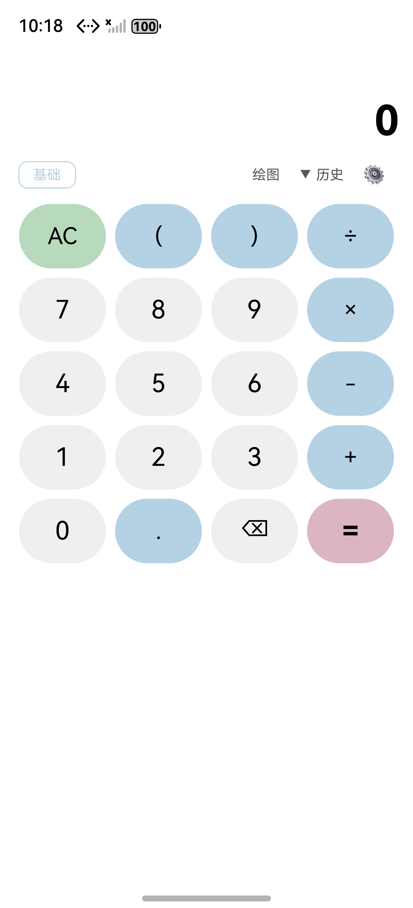
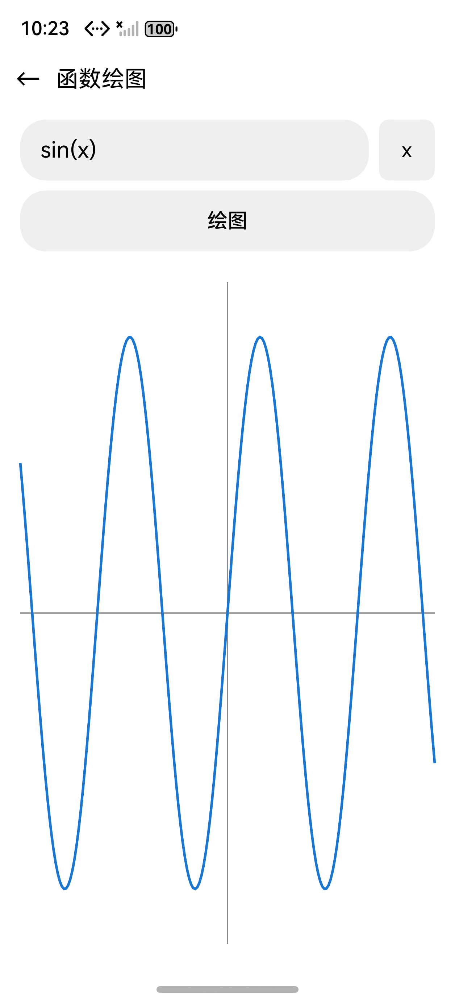
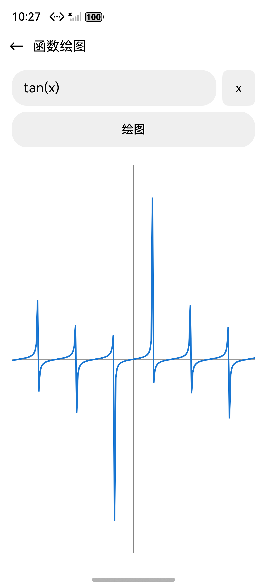

# OpenCalc HarmonyOS — 函数图像绘制实验手册

> 客户 DEMO 实验手册 · 版本 1.0 · 2026-05-19
> 仓库：https://github.com/JungleTestLabs/opencalc-harmonyos · 分支 `demo3`
> 关联变更：`specs/changes/20260519-requirement-add-function-graph/`

---

## 1. 需求是什么

为 OpenCalc 计算器新增"函数图像绘制"能力：用户在 CalculatorPage 顶部点击"绘图"按钮 → 跳转到独立 `GraphPage` → 在输入框中键入含变量 `x` 的表达式(如 `sin(x)`、`x^2`、`1/x`、`tan(x)`、`sqrt(x)`)→ 点击"绘图"按钮 → Canvas 实时绘出该函数在 x ∈ [-10, 10] 区间的曲线,y 范围自动适配数据;空输入 / 语法错误 / 函数全段未定义 / 求值超时给出友好红字提示。

> **与百分号按钮 demo 的差别**:百分号按钮(`demo1`)是 **S 级** 单文件 UI 改动,算法层零改动;本期函数绘图(`demo3`)是 **M 级** 多文件特性 —— 新增 1 个独立 Canvas 页面、1 个无状态纯类 `Plotter`,并对既有 `CalcEngine.evaluate` 递归下降解析器做了"x 变量"语义增强(需与既有 `xp(...)` 函数名前瞻消歧)。涉及绘图算法、风险闭环和性能软超时,需要更完整的 AID 制品支撑。

## 2. 怎么分析的(AID 工作流)

使用 `/aid-workflow` 命令一站式跑完 PLANNING → IMPLEMENTING → APPLYING 三阶段:

| 阶段 | 主要产物 | 说明 |
|------|---------|------|
| 意图识别 | `proposal.md` | rq-parse + rq-clarify 四问澄清(入口方式 / 自变量与多函数 / x 默认范围与缩放 / 坐标系样式) |
| 仓理解 | `info.md` | 定位 `CalcEngine.evaluate` 为递归下降解析器,识别 `parseFactor` 是新增 `x` 变量识别的唯一切入点;明确 `ErrorFlags` 是静态全局态(R-02 风险来源) |
| 复杂度评估 | 直接归为 **M 级** | 多文件 + 算法 + 新增 Canvas 渲染,跳过 `complexity-assessment.md` 单独成文,纳入 `info.md` |
| 详细规格 | `delta-spec.md` | IR-PLOT-01 + SR-PLOT-01..14 + FMEA(R-01..R-10) |
| 组件设计 | `delta-design.md` | Plotter 算法(`sample` + `drawTo`)、GraphPage 状态机、`evalAt` 复用策略、Canvas 时序与防抖 |
| 设计审视 | `design-review.md` | 7 维度通过 |
| 任务拆分 | `tasks.md` + `todo.md` | 4.1 Models / 4.2 Engine / 4.3 Plotter / 4.4 GraphPage / 4.5 入口 + 字符串 / 4.6 编译 / 4.7 UI 验证 |
| 实施 | `apply-report.md` | 实际改动 + 静态等价审查 |
| 辅助验证 | `verification-report.md` | Pura 80 模拟器 12 个 P0 用例实测 + 16 张截图 |

## 3. 生成了哪些 SPEC 文件

变更目录:[`specs/changes/20260519-requirement-add-function-graph/`](./specs/changes/20260519-requirement-add-function-graph/)

- [`todo.md`](./specs/changes/20260519-requirement-add-function-graph/todo.md) — 工作流进度追踪
- [`proposal.md`](./specs/changes/20260519-requirement-add-function-graph/proposal.md) — 需求提案(含四问澄清结果)
- [`info.md`](./specs/changes/20260519-requirement-add-function-graph/info.md) — 代码仓理解(含复杂度评级 M)
- [`delta-spec.md`](./specs/changes/20260519-requirement-add-function-graph/delta-spec.md) — 详细规格(IR + 14 条 SR + FMEA R-01..R-10)
- [`delta-design.md`](./specs/changes/20260519-requirement-add-function-graph/delta-design.md) — 组件设计(Plotter 算法 / GraphPage 状态机 / Canvas 时序)
- [`design-review.md`](./specs/changes/20260519-requirement-add-function-graph/design-review.md) — 设计审视报告
- [`tasks.md`](./specs/changes/20260519-requirement-add-function-graph/tasks.md) — 任务清单(7 块 + 12 个 P0 UI 用例)
- [`apply-report.md`](./specs/changes/20260519-requirement-add-function-graph/apply-report.md) — 实施报告
- [`verification-report.md`](./specs/changes/20260519-requirement-add-function-graph/verification-report.md) — 辅助验证报告(含模拟器实测 16 张截图)

## 4. 改了哪些文件

| 文件 | 改动 | 说明 |
|------|------|------|
| `entry/src/main/ets/calculator/Plotter.ets` | **新增 202 行** | 无状态纯类(静态 `sample` + `drawTo` + 私有 helpers),包含 200 ms 软超时、|Δy|>5×range 断点检测、isFinite + |y|≤1e15 三重过滤 |
| `entry/src/main/ets/pages/GraphPage.ets` | **新增 207 行** | `@Entry` Canvas 页面,5 个 `@State`、7 个主题 getter(拷贝模式)、300 ms 防抖、`onPlot` / `onAreaChange` |
| `entry/src/main/ets/calculator/Calculator.ets` | +29 行 | `currentX` 字段 + `evalAt(eq, x, isDegree)` 方法 + `parseFactor` 中 `x` 变量 / `xp` 函数名前瞻消歧 |
| `entry/src/main/ets/model/Models.ets` | +25 行 | 新增 3 个 interface:`GraphConfig` / `PlotPoint` / `PlotResult` |
| `entry/src/main/ets/pages/CalculatorPage.ets` | +4 行 | `import { router }` + 顶部工具栏插入 `Text('绘图')` 按钮 |
| `entry/src/main/resources/base/element/string.json` | +6 条 | `graph_button` / `graph_title` / `graph_hint_empty` / `graph_hint_syntax_error` / `graph_hint_undefined` / `graph_hint_timeout` |
| `entry/src/main/resources/base/profile/main_pages.json` | +1 行 | 注册 `pages/GraphPage` |

**核心代码 1 — 递归下降解析器中"x 变量 vs xp 函数名"前瞻消歧**:

```typescript
// Calculator.ets parseFactor 中,在函数名扫描分支之前插入:
else if (this.c === 120) {   // ASCII 'x'
  const nextC: number = this.p + 1 < this.eq.length ? this.eq.charCodeAt(this.p + 1) : -1
  const isPartOfFunctionName: boolean = (nextC >= 97 && nextC <= 122)  // 后接小写字母 → 是 xp/xyz 等函数名
  if (!isPartOfFunctionName) {
    this.nx()
    x = this.currentX                        // 用当前采样点的 x
    if (this.eat(94)) x = this.powx(x, this.parseFactor())   // 处理 x^expr
    return x
  }
  // 否则继续走原函数名扫描分支,保留 xp(...) 等既有语义
}
```

**核心代码 2 — Plotter 采样循环(每点重置 ErrorFlags + 软超时 + 域过滤)**:

```typescript
// Plotter.ets sample(): 200ms 软超时 + 每点 ErrorFlags.reset() + 三重过滤
const startTs: number = Date.now()
for (let i = 0; i < cfg.sampleCount; i++) {
  if (i % 100 === 0 && Date.now() - startTs > 200) break    // 软超时兜底
  const x: number = cfg.xMin + (cfg.xMax - cfg.xMin) * i / (cfg.sampleCount - 1)
  ErrorFlags.reset()                                          // 全局态隔离
  let y: number = NaN, defined: boolean = false
  try {
    y = engine.evalAt(prepared, x, isDegree)
    defined = !ErrorFlags.domain_error && !ErrorFlags.syntax_error
      && isFinite(y) && Math.abs(y) <= 1e15                   // 三重过滤
  } catch { defined = false }
  points.push({ x, y, defined })
}
```

**为什么把 Plotter 设计为无状态纯类、把主题色 getter 在 GraphPage 内拷贝一份**:`Plotter` 不持有任何 `@State`,纯函数式利于单测和复用;主题 getter(`getBg`/`getCurve`/`getAxis`/`getT1`/`getT2`/`getErr`/`getBtnBg`)拷贝而非引用 CalculatorPage,避免 GraphPage 与既有页面之间产生耦合 —— 任一页面单独改主题色不影响另一方。代价是 ~30 行重复的 switch,但权衡后是更稳妥的选择。

## 5. 最后结果

### 编译结果

- ✅ CLI `hvigorw clean` → 996 ms `BUILD SUCCESSFUL`
- ✅ CLI `hvigorw assembleApp --mode debug --daemon` → 5 s 759 ms 出 `entry-default-unsigned.hap`
- ✅ ArkTS 静态检查:**0 error**,仅遗留弃用提示(`getContext` / `pushUrl` / `back` / `showToast`,与本期新代码无关)
- ✅ `hdc install`:`install bundle successfully. AppMod finish`
- ✅ `aa start -b com.darkempire78.opencalculator -a EntryAbility`:`start ability successfully.`

> **环境前置**:DevEco 6.0.2 把 HarmonyOS SDK 装成嵌套结构 `sdk/default/openharmony/{ets,js,native,previewer,toolchains}/`,而 hvigor 6.0.2 默认走平铺扫描,会触发 `00303168 SDK component missing`。本仓 [`scripts/fix-deveco-sdk.sh`](./scripts/fix-deveco-sdk.sh) 在 `sdk/default/` 下创建 5 个根级符号链接指向 `openharmony/<同名>`(不动 `sdk-pkg.json`),已闭环。

### 功能展示

Pura 80 模拟器实测截图(HarmonyOS 6.0.2,1256×2760,API 22):

<table>
<tr>
<td align="center"><br/>① 主界面顶部"绘图"按钮</td>
<td align="center"><br/>② <code>sin(x)</code> 正弦曲线 ≈ 3 周期</td>
<td align="center"><br/>③ <code>tan(x)</code> 渐近线断开折线</td>
</tr>
</table>

`x ∈ [-10, 10]`、y 范围数据自适配 + 10% padding;X/Y 轴穿过画布、原点居中(若在视野内);1/x、tan(x) 的渐近线处通过 `|Δy| > 5×range` 阈值自动断开,不出现穿屏直线。

### 功能验证

| # | 测试 | 输入 | 预期 | 实测 | 截图 |
|---|------|------|:---:|:---:|:---:|
| 1 | 主界面入口 | 启动 App | "绘图"按钮位于 Sci 与 历史/⚙ 之间 | ✅ | [01](./specs/changes/20260519-requirement-add-function-graph/screenshots/01-main.png) |
| 2 | GraphPage 初次进入 | 点击"绘图" | 标题 / 返回 / 输入框 / x 键 / 绘图 按钮 / 空 Canvas | ✅ | [02](./specs/changes/20260519-requirement-add-function-graph/screenshots/02-graph-empty.png) |
| 3 | 正弦曲线 | `sin(x)` | ≈3 周期 + X/Y 轴可见 | ✅ | [07](./specs/changes/20260519-requirement-add-function-graph/screenshots/07-sin-result.png) |
| 4 | 抛物线 | `x^2` | 开口向上,顶点≈原点 | ✅ | [08](./specs/changes/20260519-requirement-add-function-graph/screenshots/08-xsquared.png) |
| 5 | 一次函数 | `2*x+1` | 直线,过 y=1,斜率 2 | ✅ | [09](./specs/changes/20260519-requirement-add-function-graph/screenshots/09-2x-plus-1.png) |
| 6 | 双曲线(断点) | `1/x` | x=0 处断开,两分支 | ✅ | [10](./specs/changes/20260519-requirement-add-function-graph/screenshots/10-1over-x.png) |
| 7 | 渐近线(断点) | `tan(x)` | ≈6 段折线,渐近线处断开 | ✅ | [11](./specs/changes/20260519-requirement-add-function-graph/screenshots/11-tan-x.png) |
| 8 | 定义域受限 | `sqrt(x)` | 仅 x≥0 部分绘出 | ✅ | [12](./specs/changes/20260519-requirement-add-function-graph/screenshots/12-sqrt-x.png) |
| 9 | 空输入错误 | (空) | 红字"请输入表达式" | ✅ | [13](./specs/changes/20260519-requirement-add-function-graph/screenshots/13-empty-error.png) |
| 10 | 语法错误 | `sin(` (IME 补齐为 `sin()`) | 红字"函数在该区间未定义" | ✅ | [14](./specs/changes/20260519-requirement-add-function-graph/screenshots/14-syntax-error.png) |
| 11 | 错误恢复 | 错误后 `cos(x)` | 错误消失,正常绘出余弦 | ✅ | [15](./specs/changes/20260519-requirement-add-function-graph/screenshots/15-recovery-cos.png) |
| 12 | 返回主页 | 点击 ← | 回到 CalculatorPage,主界面态保持 | ✅ | [16](./specs/changes/20260519-requirement-add-function-graph/screenshots/16-back-to-main.png) |

### 辅助审查

- 代码审查 **7 维度全部 [PASS]**(正确性 / 鲁棒性 / 安全性 / 可维护性 / 性能 / 主题响应 / 布局合理性)
- 风险与缓解:**FMEA R-01..R-10 高危项 7/7 闭环**:R-01 evaluate 不可重入(主线程串行)、R-02 ErrorFlags 全局态(每点 reset)、R-03 `x` vs `xp` 首字母冲突(nextC 前瞻)、R-04 长表达式 × 600 点(200 ms 软超时)、R-06 Canvas onReady vs onAreaChange 时序(canvasReady 状态机)、R-07 tan(x) 穿屏(|Δy| 阈值断开)、R-10 setTimeout 泄漏(aboutToDisappear clearTimeout)
- 详见 [`verification-report.md`](./specs/changes/20260519-requirement-add-function-graph/verification-report.md)

## 6. 客户 DEMO 操作指南

### 6.1 如何编译运行

```bash
# 前提:DevEco Studio 6.0.2+ 已安装、HarmonyOS SDK 6.0.2(API 22)已下载

# 步骤 0:首次拉代码后,修复 DevEco 6.0.2 SDK 嵌套布局(一次性,幂等)
sudo bash scripts/fix-deveco-sdk.sh

# 步骤 1:打开项目(IDE 与 CLI 任选)
open -a "DevEco-Studio" /path/to/opencalc-harmonyos
# 或者 CLI:
hvigorw clean
hvigorw assembleApp --mode debug --daemon

# 步骤 2:启动模拟器(Pura 80,HarmonyOS 6.0.2 / API 22)
#   IDE:Device Manager → 选择 Pura 80 → Start
#   或 CLI:hdc list targets 确认设备已就绪

# 步骤 3:安装并启动
export PATH="/Applications/DevEco-Studio.app/Contents/sdk/default/openharmony/toolchains:$PATH"
hdc install entry/build/default/outputs/default/entry-default-unsigned.hap
hdc shell aa start -b com.darkempire78.opencalculator -a EntryAbility
```

### 6.2 如何演示

1. 打开计算器主界面,观察顶部工具栏:`Rad` `Sci` `绘图` `历史` `⚙`(共 5 项,新增了"绘图")
2. 点击"绘图",进入 `GraphPage`:标题"函数绘图"、左上 ←、表达式输入框、x 快捷键、"绘图"按钮、空 Canvas
3. 输入 `sin(x)`,点"绘图" → 正弦曲线 ≈3 周期(默认弧度模式)
4. 输入 `x^2`,点"绘图" → 抛物线
5. 输入 `2*x+1`,点"绘图" → 直线
6. 输入 `1/x`,点"绘图" → 双曲线,x=0 处自动断开
7. 输入 `tan(x)`,点"绘图" → 渐近线处断开折线(不穿屏)
8. 输入 `sqrt(x)`,点"绘图" → 仅 x≥0 部分有曲线
9. 清空输入再点"绘图" → 红字"请输入表达式"
10. 输入残缺式 `sin(` → 红字"函数在该区间未定义";然后输入 `cos(x)` 重画,错误消失
11. 切换主题(回到主界面 → ⚙ → 主题 → 浅色/暗色/AMOLED),再进 `GraphPage`,验证背景 / 曲线 / 坐标轴颜色跟随
12. 横屏旋转设备,300 ms 防抖后 Canvas 自动重绘,曲线适配新画布尺寸
13. 点击 ← 返回主界面,计算器原状态保持

### 6.3 出了问题怎么对比查看

1. **CLI 编译 `00303168 SDK component missing`?** → 跑 `sudo bash scripts/fix-deveco-sdk.sh`;如果之前改过 `hos-config.json`,**必须** `pkill -f daemon-process-boot-script.js && pkill -f hvigor-java-daemon.jar` 杀掉 hvigor daemon 后才能让新配置生效(DevEco GUI 重启不杀 daemon)。
2. **"绘图"按钮不见?** → 检查 `CalculatorPage.ets` 顶部工具栏 Row 是否包含 `Text('绘图')` 及其 `onClick → router.pushUrl({url:'pages/GraphPage'})`;并确认 `main_pages.json` 已注册 `pages/GraphPage`。
3. **跳到 GraphPage 但 Canvas 空白?** → 看 `GraphPage.ets` 中 `canvasReady` 状态机:必须在 `Canvas.onReady` 回调内置 `true` 后,`onPlot` 才会调 `Plotter.drawTo`;否则会等到下次点击。
4. **`sin(x)` 报"函数在该区间未定义"?** → 检查 `Calculator.ets parseFactor` 的 `else if (this.c === 120)` 分支是否在函数名扫描 **之前**;若位置错放,会被吞进函数名扫描,识别成未定义函数 `x`。
5. **`xp(2)` 等价 `e^2` 失效?** → 同上,前瞻 `nextC >= 97 && nextC <= 122` 必须正确判断后续字符是小写字母,否则 `xp` 会被切成"x + p"。
6. **`tan(x)` 出现穿屏直线?** → `Plotter.ets drawTo` 中 `|Δy| > 5 × (yMax - yMin)` 阈值是否被改动;阈值过大会丢失断点。
7. **长表达式输入卡顿?** → `Plotter.ets sample` 中 200 ms 软超时是否还在;`i % 100 === 0 && Date.now() - startTs > 200` 早退条件不能删。
8. **主题切换后曲线颜色没变?** → `GraphPage.ets` 7 个 getter 必须返回响应式表达式(`switch (this.themeIdx)`),不能硬编码颜色。
9. **横屏旋转曲线没重绘?** → `Canvas.onAreaChange` 回调里的 300 ms 防抖 `setTimeout` 是否还在,以及 `aboutToDisappear` 里有没有 `clearTimeout`(防泄漏)。
10. **对比早期 demo 版本?** → 参考 demo1 分支的 `DEMO_GUIDE.md`(百分号按钮 S 级)与本期 demo3(函数绘图 M 级)的复杂度差异。

### 6.4 如果客户没做完

所有 SPEC 文件 + 验证报告 + AID 制品已在 [`specs/changes/20260519-requirement-add-function-graph/`](./specs/changes/20260519-requirement-add-function-graph/) 中。直接阅读:

- 需求分析 → [`proposal.md`](./specs/changes/20260519-requirement-add-function-graph/proposal.md)
- 仓理解 + 复杂度 → [`info.md`](./specs/changes/20260519-requirement-add-function-graph/info.md)
- 验收标准 → [`delta-spec.md`](./specs/changes/20260519-requirement-add-function-graph/delta-spec.md)
- 架构设计 → [`delta-design.md`](./specs/changes/20260519-requirement-add-function-graph/delta-design.md)
- 实施详情 → [`apply-report.md`](./specs/changes/20260519-requirement-add-function-graph/apply-report.md)
- 验证结果 → [`verification-report.md`](./specs/changes/20260519-requirement-add-function-graph/verification-report.md)
