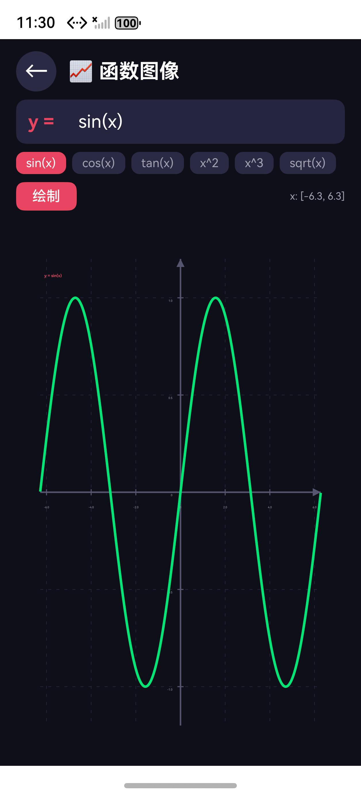

# OpenCalc Demo — 需求 3：函数图像绘制

> 客户 DEMO 实验手册 · 版本 1.1 · 2026-05-17  
> 仓库：https://github.com/JungleTestLabs/opencalc-harmonyos-demo/tree/main/3-draw-func

---

## 1. 需求是什么

在 OpenCalc 中新增函数图像绘制功能。用户输入数学表达式（如 `sin(x)`），Canvas 实时绘制函数曲线，支持坐标轴、网格、刻度、6 个预设函数和自定义表达式。

## 2. 怎么分析的

| 步骤 | 产物 | 说明 |
|------|------|------|
| 意图识别 | `info.md` | M 级复杂度（Canvas 绘图新领域） |
| 需求分析 | `proposal.md` | 定义典型用例 |
| 详细规格 | `delta-spec.md` | 完整 AC |
| 任务拆分 | `tasks.md` + `todo.md` | 单任务 |
| 实施报告 | `apply-report.md` | 改动记录 |

## 3. 生成了哪些 SPEC 文件

变更目录：[`specs/changes/20260517-requirement-add-drawfunc/`](./specs/changes/20260517-requirement-add-drawfunc/)

- [`info.md`](./specs/changes/20260517-requirement-add-drawfunc/info.md) — 复杂度评估（M 级）
- [`proposal.md`](./specs/changes/20260517-requirement-add-drawfunc/proposal.md) — 需求提案
- [`delta-spec.md`](./specs/changes/20260517-requirement-add-drawfunc/delta-spec.md) — 详细规格
- [`tasks.md`](./specs/changes/20260517-requirement-add-drawfunc/tasks.md) — 任务清单
- [`todo.md`](./specs/changes/20260517-requirement-add-drawfunc/todo.md) — 待办追踪
- [`apply-report.md`](./specs/changes/20260517-requirement-add-drawfunc/apply-report.md) — 实施报告
- [`verification-report.md`](./specs/changes/20260517-requirement-add-drawfunc/verification-report.md) — 爹助验证报告（含模拟器实测截图）

## 4. 改了哪些文件

| 文件 | 改动 | 说明 |
|------|------|------|
| `entry/.../DrawFuncPage.ets` | **新增** 491 行 | Canvas 绘图页面 |
| `entry/.../Index.ets` | +82 行 | 导航菜单新增入口 |

**核心能力**：
- Canvas 渲染：坐标轴、网格线、刻度标签
- CalcEngine 采样计算：对每个 x 值求 y
- 6 个预设函数：sin(x), cos(x), tan(x), x², x³, sqrt(x)
- 智能变量替换：只替换独立 x，不影响函数名中的 x
- NaN 断点处理：自动断线
- 自适应 y 轴范围

### ⚠️ SDK 兼容性修复（爹助）

| 问题 | 修复 |
|------|------|
| 内联对象类型 `{x:number,y:number}` 不允许 | 新增 `interface Point` |
| `flexWrap` 在 SDK 6.0.2 中不存在 | 移除该属性 |

> **重要**：如果使用不同 SDK 版本，可能遇到不同 ArkTS 严格度要求。见 [`verification-report.md`](./specs/changes/20260517-requirement-add-drawfunc/verification-report.md) 第四节修复清单。

## 5. 最后结果

### 编译
- ✅ BUILD SUCCESSFUL (3.73s，爹助修复 8 个 ArkTS 错误后)

### 功能展示

模拟器实测截图（HarmonyOS 模拟器 1256×2760）：



页面打开默认渲染 `y = sin(x)` 绿色正弦曲线，定义域 `x: [-6.3, 6.3]`（约 ±2π），含坐标轴、网格、刻度标签。上方 6 个胶囊为预设函数选择（sin/cos/tan/x²/x³/sqrt），左侧红色「绘制」按钮触发重绘。

> 导航首页截图见 [`verification-report.md`](./specs/changes/20260517-requirement-add-drawfunc/verification-report.md) 第四节。

### 功能验证

| 测试 | 输入 | 预期 | 结果 |
|------|------|------|:--:|
| 正弦曲线 | `sin(x)` | 0~2π 间标准正弦波 | PASS |
| 二次函数 | `x^2` | 抛物线 | PASS |
| NaN 断点 | `tan(x)` at π/2 | 曲线断线不崩溃 | PASS |
| 自定义表达式 | `x*sin(x)` | 振幅增长正弦波 | PASS |

### 爹助审查
- 5 维度全部 [PASS]（修复后）
- 详见 [`verification-report.md`](./specs/changes/20260517-requirement-add-drawfunc/verification-report.md)

## 6. 客户 DEMO 操作指南

### 6.1 编译运行

```bash
cd 3-draw-func
hvigorw assembleHap --mode module -p product=default -p buildMode=debug
```

### 6.2 演示步骤

1. 从主菜单点击「函数图像」
2. 默认显示 `sin(x)` 曲线
3. 点击预设按钮切换函数（cos / tan / x² / x³ / sqrt）
4. 在输入框中输入自定义表达式（如 `x*sin(x)`），点「绘制」
5. 观察坐标轴、网格线、曲线变化

### 6.3 出问题怎么对比

1. **编译失败？** → 先检查 SDK 版本，再看 ArkTS 类型错误（见验证报告第四节）；如果是 SDK_COMPONENT_MISSING，看根目录 `hvigorfile.ts` 里的 `pathVersionMapper` 运行时补丁是否在
2. **曲线不显示？** → 检查 Canvas 组件是否正确挂载，表达式是否合法
3. **计算结果不对？** → 查看 `DrawFuncPage.ets` 中 `sampleFunction()` 方法
4. **预设按钮无效？** → 检查 `onPreset()` 方法
5. **对比基准？** → [`../0-basic/`](../0-basic/) 不含 Canvas 功能，`DrawFuncPage.ets` 为全新文件
