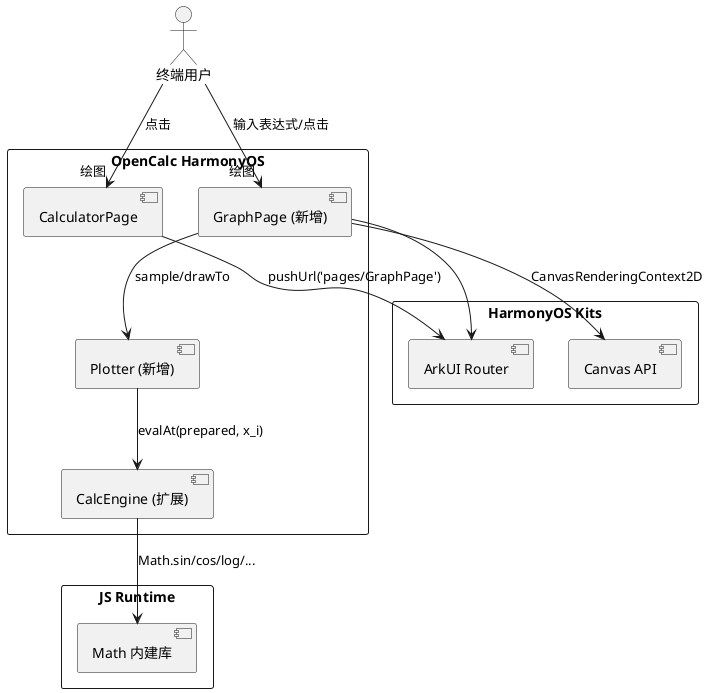
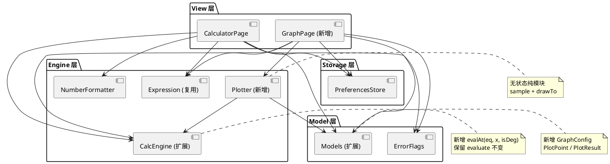
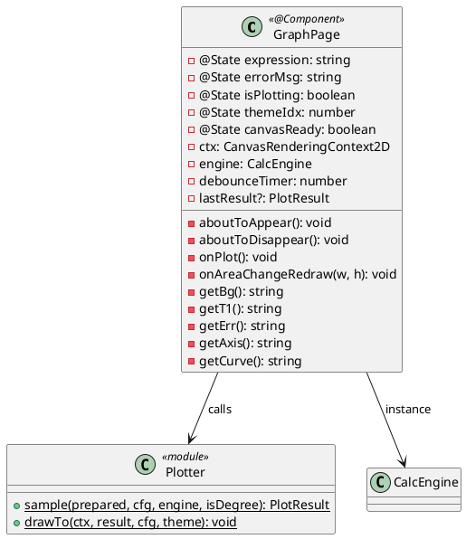
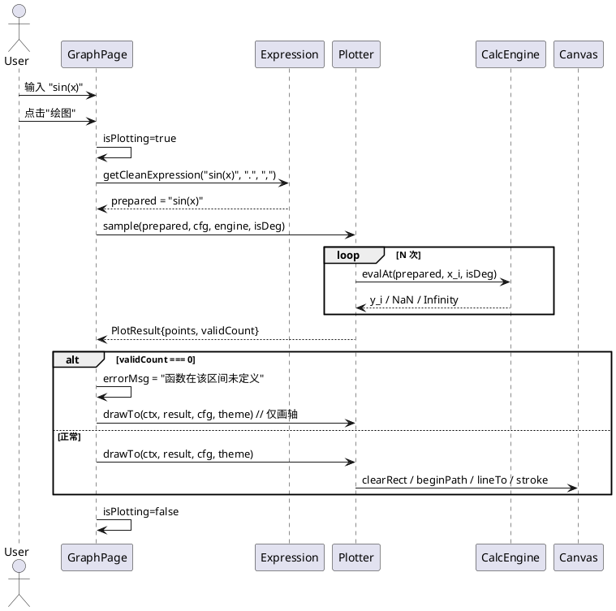
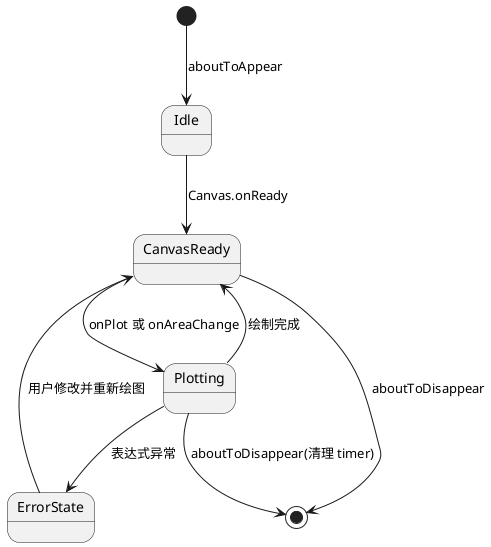
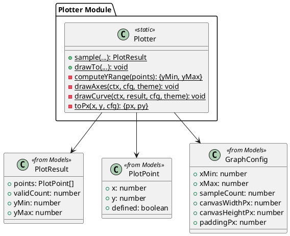
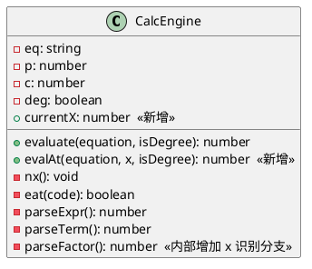
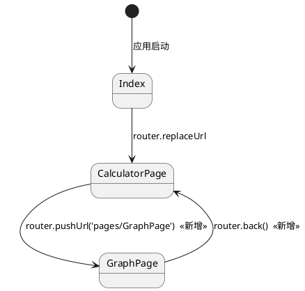

# 函数图像绘制 增量设计文档（delta-design）

> 本文为 `feat-function-graph` 特性的**增量设计文档**。由于 `specs/specs/feat-function-graph/` 不存在,本 delta-design 即作为该特性的完整设计文档。
>
> **设计范围**：在不破坏现有 MVVM-Lite 分层(Page + Engine + Model)前提下,新增 GraphPage、Plotter 模块,扩展 CalcEngine 与 Models,修改 CalculatorPage 顶部菜单与资源配置。
>
> **关联输入**:
> - 需求提案: [proposal.md](./proposal.md)
> - 需求规格: [delta-spec.md](./delta-spec.md)
> - 代码仓理解: [info.md](./info.md)

---

## 1. 概述

### 1.1 应用定位

OpenCalc HarmonyOS 是一款本地化的科学计算器应用,本期新增"函数图像绘制"能力。用户在已有"四则/科学计算"能力之上,可在独立的 GraphPage 输入含变量 `x` 的表达式(如 `sin(x)`、`x^2`、`ln(x+1)`),通过 Canvas 折线图直观查看函数曲线,辅助学习/教学/快速验证函数趋势。

### 1.2 核心交互

```
用户在计算器主页点击顶部"绘图"按钮
  → router.pushUrl 跳转 GraphPage
  → 输入表达式 "sin(x)"
  → 点击"绘图"按钮
  → Canvas 渲染正弦曲线 + X/Y 坐标轴
  → 返回 CalculatorPage
```

### 1.3 技术栈概览

| 项 | 选型 |
|----|------|
| 框架 | ArkTS、Stage 模型、ArkUI 声明式 UI |
| 状态管理 | V1(`@State`/`@Prop`/`@Link`)— 与现有 CalculatorPage 保持一致 |
| 关键 Kit | `@kit.ArkUI`(router、Canvas)、`@kit.ArkData`(preferences,沿用现有) |
| Native | 无 |
| Hvigor 插件 | 无新增,沿用现有 build-profile.json5 |

---

## 2. 功能清单

| 功能名 | 说明 | 入口 Ability/Page | 优先级 |
|--------|------|-------------------|--------|
| 计算器主页"绘图"入口 | CalculatorPage 顶部菜单栏新增"绘图"按钮 | CalculatorPage | P0 |
| 单函数曲线绘制 | 在 [-10, 10] 上采样 + Canvas 折线绘制 | GraphPage | P0 |
| 坐标系绘制 | X/Y 轴 + 原点(无刻度/网格/标签) | GraphPage | P0 |
| 错误提示 | 语法错误/全段未定义时显示中文文案 | GraphPage | P0 |
| 不连续点处理 | NaN/Infinity/|Δy| 超阈值断开折线 | GraphPage / Plotter | P0 |
| 主题适配 | 三种主题(默认/AMOLED/Material You)颜色适配 | GraphPage | P1 |
| 横竖屏适配 | onAreaChange 重绘,防抖 300ms | GraphPage | P1 |
| 性能与防抖 | 主线程 ≤200ms、按钮防抖 300ms、绘图中按钮置灰 | GraphPage / Plotter | P1 |

- **P0**:核心功能,无则无法使用本特性
- **P1**:重要功能,影响体验一致性
- **P2**:辅助功能 — 本期无 P2 项

---

## 3. 实现模型

### 3.1 上下文视图



### 3.2 总体架构



**单向数据流**:`View → Engine → Model`,无反向依赖。`Plotter` 是无状态工具模块,不持有任何长生命周期状态。

### 3.3 HAP/HAR/HSP 模块划分

| 模块 | 类型 | 变更 | 说明 |
|------|------|------|------|
| entry | HAP | 修改 | 唯一 HAP,新增页面与工具模块均位于此模块下 |

无新增 HAR / HSP / OHPM 依赖。

### 3.4 设计系统规格

#### 3.4.1 色彩系统

复用现有三套主题的色板,GraphPage 内部以**拷贝模式**实现同名 getter(不抽取公共模块,避免回归风险,详见 info.md §4)。

| 名称 | 默认主题 | AMOLED | Material You(暗色) | 用途 |
|------|---------|--------|---------------------|------|
| bg | `#FFFFFF` | `#000000` | `#1C1B1F` | 页面背景 / Canvas 背景 |
| t1(主前景) | `#000000` | `#FFFFFF` | `#E6E0E9` | 表达式/错误文本主色 |
| t2(次前景) | `#666666` | `#999999` | `#938F99` | 提示性文本 |
| axis(坐标轴) | `#888888` | `#666666` | `#6F6B7E` | X/Y 轴线 |
| curve(曲线) | `#1976D2` | `#00BCD4` | `#A8C7FA` | 函数曲线主色 |
| err(错误) | `#D32F2F` | `#FF6B6B` | `#F2B8B5` | 错误信息红色文本 |

> **设计决策**:`axis`、`curve` 色值是本期新增,但**不写入 color.json**(避免引入资源切换链路)。GraphPage 内联硬编码常量,与 `getBg/getT1/...` 同样风格。

#### 3.4.2 主题系统

| 输入 | 处理 |
|------|------|
| `PreferencesStore.getTheme()` 返回 `0\|1\|2` | GraphPage.aboutToAppear 读取一次,存入 `@State themeIdx` |
| 主题切换 | 本期 GraphPage 内**不提供**主题切换入口;若用户在 CalculatorPage 切换后再进入 GraphPage,会读到新值 |

#### 3.4.3 排版系统

| 名称 | 字号 | 用途 |
|------|------|------|
| display | 20fp | 表达式输入框 |
| button | 16fp | 按钮文字("x"、"绘图") |
| caption | 14fp | 错误提示行 |

#### 3.4.4 间距与尺寸系统

| 名称 | 值 | 用途 |
|------|----|----|
| padding-page | 16vp | 页面四周内边距 |
| gap-row | 12vp | 行间距 |
| canvas-min-height | 240vp | Canvas 最小高度(竖屏) |
| canvas-stretch | 1fr | Canvas 在 Column 中以 layoutWeight 占满剩余空间 |
| button-height | 48vp | 按钮统一高度 |

#### 3.4.5 图标与图形资源

| 名称 | 类型 | 尺寸 | 用途 |
|------|------|------|------|
| graph_icon | 文本符号"📈"或简化字符 | — | "绘图"按钮(本期不引入 SVG 资源) |
| arrow_back | 系统返回 | — | GraphPage 标题栏返回 |

> **设计决策**:本期"绘图"按钮使用**纯文字**("绘图"二字)以避免引入图标资源,与 CalculatorPage 现有"⚙"、"历史"按钮风格一致。

#### 3.4.6 动画规格

无动画。Canvas 重绘为同步绘制(单次 clearRect + 折线),不引入过渡动画。

#### 3.4.7 响应式断点与栅格

| 断点 | 行为 |
|------|------|
| sm(< 480vp,竖屏手机) | 表达式输入行高度固定 48vp,Canvas 撑满剩余空间 |
| md/lg(横屏 / 折叠屏展开) | 同布局,Canvas 自动变宽,采样点数随 `canvasWidthPx` 自适应 |

监听:Canvas `onAreaChange` → 防抖 300ms → 重新采样 + 重绘。

---

### 3.5 GraphPage 模块实现设计

#### 3.5.1 模块介绍

- **身份**:`@Component`(非 `@Entry`),由 CalculatorPage 通过 `router.pushUrl` 跳入
- **职责**:承载函数绘图的所有 UI 交互(表达式输入、x 按钮、绘图按钮、Canvas、错误提示),将求值与绘制委托给 Plotter
- **不负责**:数据持久化、网络访问、主题切换 UI

#### 3.5.2 功能描述

1. 顶部标题栏:左侧返回按钮 + 标题"函数绘图"
2. 表达式输入行:`TextInput` + "x" 快捷按钮
3. 操作行:"绘图" 主按钮(绘图中置灰)
4. Canvas 区:LayoutWeight 撑满
5. 错误提示行:Canvas 下方一行红色文本

#### 3.5.3 目录结构

```
entry/src/main/ets/
├── pages/
│   ├── CalculatorPage.ets       # (修改)新增"绘图"按钮
│   ├── GraphPage.ets            # (新增)
│   └── Index.ets                # (不变)
├── calculator/
│   ├── Calculator.ets           # (修改)新增 currentX/evalAt
│   ├── Expression.ets           # (不变)
│   ├── NumberFormatter.ets      # (不变)
│   └── Plotter.ets              # (新增)
├── model/
│   ├── Models.ets               # (修改)新增 GraphConfig/PlotPoint/PlotResult
│   └── ErrorFlags.ets           # (不变)
└── preferences/
    └── PreferencesStore.ets     # (不变)
```

#### 3.5.4 架构图谱

**GraphPage 类图(@Component)**



**绘图时序图**



**GraphPage 状态机**



#### 3.5.5 功能与用例分析

```
用例:UC-001-01 绘制单函数曲线
前置条件:GraphPage 已就绪,Canvas 已 onReady,用户已输入合法表达式
步骤:
  1. 用户点击"绘图"按钮
  2. GraphPage 读取 expression,调用 Expression.getCleanExpression
  3. GraphPage 计算采样点数 N = clamp(canvasWidthPx/2, 200, 600)
  4. 调用 Plotter.sample 获得 PlotResult
  5. 若 result.validCount === 0 → 设置 errorMsg
  6. 调用 Plotter.drawTo 渲染坐标轴 + 曲线
后置条件:Canvas 显示曲线或错误提示

用例:UC-003-01 错误表达式不崩溃
前置条件:GraphPage 已就绪
步骤:
  1. 用户输入 "sin(" 并点击"绘图"
  2. Plotter.sample 中调用 Expression.getCleanExpression 抛错 → catch
  3. errorMsg = "表达式语法错误"
  4. Canvas 清空,仅画坐标轴
  5. isPlotting = false
后置条件:错误文本可见,按钮恢复可点
```

#### 3.5.6 接口设计

GraphPage 不对外暴露接口(纯 @Component)。内部方法签名:

| 方法 | 签名 | 说明 |
|------|------|------|
| `aboutToAppear` | `(): void` | 创建 engine 实例,读取 theme |
| `aboutToDisappear` | `(): void` | clearTimeout(debounceTimer);释放 engine 引用 |
| `onPlot` | `(): void` | 触发一次采样 + 绘制 |
| `onAreaChangeRedraw` | `(w: number, h: number): void` | 防抖 300ms 后调用 onPlot |

#### 3.5.7 状态管理设计

使用 V1 状态管理(与 CalculatorPage 一致):

```
@State expression: string = ''       // 用户输入
@State errorMsg: string = ''         // 错误文案
@State isPlotting: boolean = false   // 绘图中标志(按钮置灰)
@State themeIdx: number = 0          // 主题索引
@State canvasReady: boolean = false  // Canvas onReady 状态机
```

**非响应式字段**(不需要 UI 重渲染):

```
private ctx: CanvasRenderingContext2D = new CanvasRenderingContext2D(...)
private engine: CalcEngine = new CalcEngine()
private debounceTimer: number = -1
private canvasWidthPx: number = 0
private canvasHeightPx: number = 0
```

**数据流**:

```
用户输入 → @State expression
点击按钮 → @State isPlotting=true → Plotter.sample/drawTo → @State isPlotting=false
出错 → @State errorMsg → UI 显示
```

#### 3.5.8 核心算法

无独立算法,采样/坐标变换/折线绘制均在 Plotter 内实现(见 §3.6.8)。

#### 3.5.9 错误处理

| 错误来源 | 处理 | 用户感知 |
|---------|------|---------|
| Expression.getCleanExpression 抛出 | try-catch → errorMsg="表达式语法错误" | 红色错误行 |
| Plotter.sample 返回 validCount=0 | errorMsg="函数在该区间未定义" | 红色错误行;Canvas 仅画轴 |
| Plotter 内部异常(理论上不应发生) | try-catch → errorMsg="绘图失败" + `console.error` | 红色错误行 |
| 空表达式 | onPlot 入口校验:errorMsg="请输入表达式" | 红色错误行 |

#### 3.5.10 依赖关系

- **内部依赖**:`CalcEngine`、`Expression`、`Plotter`、`Models`、`PreferencesStore`
- **外部依赖**:`@kit.ArkUI`(router、Canvas、CanvasRenderingContext2D、RenderingContextSettings)

---

### 3.6 Plotter 模块实现设计

#### 3.6.1 模块介绍

- **身份**:`calculator/Plotter.ets` — 无状态工具模块(纯函数集合)
- **职责**:对预处理后的表达式进行等间隔采样;在 Canvas 上绘制坐标轴 + 折线
- **不负责**:UI 状态、错误文案翻译、主题颜色解析(由 GraphPage 传入)

#### 3.6.2 功能描述

1. `sample(prepared, cfg, engine, isDegree)`:在 [xMin, xMax] 等间隔采样 N 点,每点 evalAt 求 y,标记 defined
2. `drawTo(ctx, result, cfg, theme)`:清空 Canvas → 画轴 → 逐段画折线(断点自动断开)

#### 3.6.3 目录结构

```
entry/src/main/ets/calculator/
└── Plotter.ets    # 单文件,~150 行
```

#### 3.6.4 架构图谱

**Plotter 模块结构**



#### 3.6.5 功能与用例分析

```
用例:Plotter.sample 采样 sin(x) 在 [-10, 10]
前置条件:engine 已构造,prepared = "sin(x)",cfg.sampleCount=600
步骤:
  1. step = (xMax - xMin) / (N - 1) = 20 / 599
  2. for i in 0..N-1:
       x = xMin + i*step
       ErrorFlags.reset()
       y = engine.evalAt(prepared, x, isDegree)
       defined = isFinite(y) && !任何 ErrorFlag && |y| <= 1e15
       points[i] = {x, y, defined}
       if (defined) validCount++
  3. 计算 yMin/yMax(仅 defined 点)
后置条件:返回 PlotResult

用例:Plotter.drawTo 绘制有断点的 1/x
前置条件:PlotResult 已就绪,Canvas ctx 已挂载
步骤:
  1. ctx.clearRect(0, 0, w, h)
  2. drawAxes:画 X 轴、Y 轴、原点
  3. drawCurve:
     - 初始 inSegment = false
     - for i in 0..N-1:
         若 !points[i].defined → inSegment=false;continue
         若 inSegment && |y_i - y_{i-1}| > 5*canvasHeight → 断开;inSegment=false
         否则:
           若 !inSegment → ctx.moveTo(toPx(x_i, y_i));inSegment=true
           否则 → ctx.lineTo(toPx(x_i, y_i))
     - ctx.stroke()
后置条件:Canvas 显示两段双曲线
```

#### 3.6.6 接口设计

**ThemeColors 接口**(定义在 Plotter 模块顶部):

```typescript
export interface ThemeColors {
  axis: string
  curve: string
  bg: string
}
```

**公开静态方法**:

```typescript
export class Plotter {
  /**
   * 等间隔采样函数 y = f(x)
   * @param prepared 已经过 Expression.getCleanExpression 预处理的表达式
   * @param cfg 绘图配置
   * @param engine CalcEngine 实例(必须串行使用)
   * @param isDegree 三角函数是否按角度计算
   */
  static sample(
    prepared: string,
    cfg: GraphConfig,
    engine: CalcEngine,
    isDegree: boolean
  ): PlotResult

  /**
   * 在 Canvas 上绘制坐标轴 + 曲线
   * @param ctx Canvas 2D 渲染上下文
   * @param result 由 sample 产生的结果
   * @param cfg 与 sample 时相同的配置
   * @param theme 主题颜色
   */
  static drawTo(
    ctx: CanvasRenderingContext2D,
    result: PlotResult,
    cfg: GraphConfig,
    theme: ThemeColors
  ): void
}
```

#### 3.6.7 状态管理设计

**无状态**。所有数据通过参数传递,函数无副作用(除写 ctx 之外)。

#### 3.6.8 核心算法

##### 算法一:等间隔采样 + ErrorFlags 守护

```
输入:prepared, cfg, engine, isDegree
输出:PlotResult

points = []
validCount = 0
yMin = +Inf, yMax = -Inf
N = cfg.sampleCount
step = (cfg.xMax - cfg.xMin) / (N - 1)
softTimeoutBudget = 200  // ms
startTime = Date.now()

for i in 0..N-1:
  x = cfg.xMin + i * step
  ErrorFlags.reset()
  try:
    y = engine.evalAt(prepared, x, isDegree)
  catch:
    y = NaN
  hasError = ErrorFlags.syntax_error || ErrorFlags.division_by_0
           || ErrorFlags.out_of_range || ErrorFlags.domain_error
           || ErrorFlags.require_real_number
  defined = isFinite(y) && !hasError && Math.abs(y) <= 1e15
  if defined:
    if Math.abs(y) < 1e-10: y = 0   // 数值噪声归零
    if y < yMin: yMin = y
    if y > yMax: yMax = y
    validCount += 1
  points.push({x, y, defined})

  // 软超时检查
  if i % 100 === 99 && Date.now() - startTime > softTimeoutBudget:
    break

ErrorFlags.reset()  // 绘图结束统一清理
return {points, validCount, yMin, yMax}

复杂度:O(N · 单次求值),单次求值平均 O(L)(L=表达式长度);典型 600 点 < 50ms
```

##### 算法二:y 范围扩边 + 坐标变换

```
function fitYRange(yMin, yMax, canvasHeight):
  if yMin === +Inf: return [-1, 1]  // 无有效点兜底
  if yMax - yMin < 1e-6: return [yMin - 1, yMax + 1]  // 常函数兜底
  pad = (yMax - yMin) * 0.1
  return [yMin - pad, yMax + pad]

function toPx(x, y, cfg, yRange):
  px = cfg.paddingPx + (x - cfg.xMin) / (cfg.xMax - cfg.xMin) * (canvasWidth - 2*pad)
  py = canvasHeight - cfg.paddingPx - (y - yRange[0]) / (yRange[1] - yRange[0]) * (canvasHeight - 2*pad)
  return {px, py}
```

##### 算法三:断点检测折线绘制

```
inSegment = false
for i in 0..N-1:
  p = points[i]
  if !p.defined:
    inSegment = false
    continue
  if inSegment and i > 0 and points[i-1].defined:
    dy = Math.abs(p.y - points[i-1].y)
    if dy > 5 * (yRange[1] - yRange[0]):  // 5 倍 y 范围 = 跨越画布 5 倍
      inSegment = false
  px, py = toPx(p.x, p.y, cfg, yRange)
  if !inSegment:
    ctx.beginPath()
    ctx.moveTo(px, py)
    inSegment = true
  else:
    ctx.lineTo(px, py)
  // 每段结束(下一轮 inSegment 重置时)stroke
if inSegment: ctx.stroke()
```

> **关键决策**:断点阈值改为 **5 × y 范围**(而非 5 × canvasHeight 像素);理由是更直观且与 yRange 直接相关。

##### 算法四:坐标轴绘制

```
function drawAxes(ctx, cfg, yRange, theme):
  ctx.strokeStyle = theme.axis
  ctx.lineWidth = 1
  // X 轴:y=0 对应的画布 y 像素
  if yRange[0] <= 0 && yRange[1] >= 0:
    py0 = toPx(0, 0, cfg, yRange).py
  else:
    py0 = (yRange[0] > 0) ? cfg.canvasHeightPx - cfg.paddingPx : cfg.paddingPx
  ctx.beginPath()
  ctx.moveTo(cfg.paddingPx, py0)
  ctx.lineTo(cfg.canvasWidthPx - cfg.paddingPx, py0)
  ctx.stroke()
  // Y 轴:x=0 对应的画布 x 像素(本期 xMin=-10, xMax=10,必含 0)
  px0 = toPx(0, 0, cfg, yRange).px
  ctx.beginPath()
  ctx.moveTo(px0, cfg.paddingPx)
  ctx.lineTo(px0, cfg.canvasHeightPx - cfg.paddingPx)
  ctx.stroke()
```

#### 3.6.9 错误处理

| 错误 | 处理 |
|------|------|
| `engine.evalAt` 抛出 JS 异常(理论极少) | catch → y=NaN → defined=false |
| `ErrorFlags.syntax_error` 在第 1 个采样点就触发 | 视为"全段语法错误",由 GraphPage 检测 validCount=0 后显示错误 |
| Canvas ctx 为 null(传入异常) | drawTo 入口校验,直接 return;`console.warn` |
| 软超时触发 | 提前结束循环,使用已有的部分点;`console.warn('plot sample timeout')` |

#### 3.6.10 依赖关系

- **内部依赖**:`CalcEngine`(扩展后)、`ErrorFlags`、`Models`(GraphConfig/PlotPoint/PlotResult)
- **外部依赖**:`CanvasRenderingContext2D` 类型(来自 `@kit.ArkUI`)、`Math` 内建

---

### 3.7 CalcEngine 扩展实现设计

#### 3.7.1 模块介绍

- **身份**:`calculator/Calculator.ets`(导出类 `CalcEngine`)
- **变更类型**:**扩展**(新增字段 + 方法 + 1 处 parseFactor 修改)
- **核心约束**:保留 `evaluate(equation, isDegree)` 签名与行为**完全不变**

#### 3.7.2 功能描述

1. 新增 `currentX: number` 实例字段,默认 0
2. 新增 `evalAt(equation, x, isDegree)` 公开方法
3. `parseFactor` 中增加"`x` 变量识别"分支(在函数名扫描之前)

#### 3.7.3 目录结构

```
entry/src/main/ets/calculator/
└── Calculator.ets   # 已存在,做最小化扩展
```

#### 3.7.4 架构图谱



#### 3.7.5 功能与用例分析

```
用例:evalAt("sin(x)", 1.5708, false)
步骤:
  1. this.currentX = 1.5708
  2. 调用 evaluate("sin(x)", false)
  3. parseFactor 遇到字符 'x':
     - 前瞻:下一字符 ')' 非小写字母 → 视为变量
     - x = this.currentX = 1.5708
  4. 返回 sin(1.5708) ≈ 1.0
后置条件:返回值 ≈ 1.0

用例:evalAt("xp(2)", 0, false) 检验 xp 函数仍正常
步骤:
  1. this.currentX = 0
  2. parseFactor 遇到字符 'x':
     - 前瞻:下一字符 'p'(小写字母)→ 非变量,让函数名扫描接管
  3. 函数名扫描读到 "xp" → 匹配 powx(Math.E, 2) = e^2 ≈ 7.389
后置条件:xp 函数行为完全不变
```

#### 3.7.6 接口设计

**新增公开方法**:

```typescript
evalAt(equation: string, x: number, isDegree: boolean): number {
  this.currentX = x
  return this.evaluate(equation, isDegree)
}
```

**parseFactor 内部修改(在 Calculator.ets ~102-140 行的函数名分支之前插入)**:

```typescript
// 单字符 'x' 变量识别(在函数名扫描之前)
if (this.c === 120 /* 'x' */) {
  const nextC: number = this.p + 1 < this.eq.length
    ? this.eq.charCodeAt(this.p + 1) : -1
  const isPartOfFunctionName: boolean = (nextC >= 97 && nextC <= 122)
  if (!isPartOfFunctionName) {
    this.nx()
    let x: number = this.currentX
    if (this.eat(94 /* '^' */)) x = this.powx(x, this.parseFactor())
    return x
  }
  // 否则下方函数名扫描继续处理(xp / xpow / 任何以 x 开头的函数)
}
```

#### 3.7.7 状态管理设计

新增实例字段 `currentX: number = 0`,**仅由 `evalAt` 写入,由 `parseFactor` 读取**。`evaluate` 不读不写该字段(其内部递归仍然完整支持读到 `currentX`,因为 `parseFactor` 是 `evaluate` 调用的)。

**线程模型**:与 `evaluate` 相同 — 非线程安全,但 ArkTS UI 单线程 + Plotter 串行调用 → 天然安全(R-01)。

#### 3.7.8 核心算法

无新增算法。仅在 parseFactor 加 1 个前瞻判断(O(1) 增量)。

#### 3.7.9 错误处理

完全沿用现有 `ErrorFlags` 机制。`x` 变量识别成功后,后续运算异常(如 `1/x` 在 x=0 处)仍由 `ErrorFlags.division_by_0` 标记。

#### 3.7.10 依赖关系

无新增依赖。

---

### 3.8 Models 扩展实现设计

#### 3.8.1 模块介绍

- **身份**:`model/Models.ets`(已存在)
- **变更**:新增 3 个 interface/class

#### 3.8.2 新增类型定义

```typescript
// 绘图配置
export interface GraphConfig {
  xMin: number              // 默认 -10
  xMax: number              // 默认 10
  sampleCount: number       // clamp(canvasWidthPx/2, 200, 600)
  canvasWidthPx: number     // 来自 Canvas.onAreaChange / onReady
  canvasHeightPx: number
  paddingPx: number         // 默认 16
}

// 单个采样点
export interface PlotPoint {
  x: number
  y: number
  defined: boolean
}

// 一次绘图的产物
export interface PlotResult {
  points: PlotPoint[]
  validCount: number
  yMin: number
  yMax: number
}
```

#### 3.8.3 设计决策

- 使用 `interface` 而非 `class` — 这些是纯数据结构,无方法,与 ArkTS DTO 风格一致(参考现有 `HistoryItem`)
- **不持久化**:这些类型不进 PreferencesStore,不写入 RDB
- **导出**:与现有 `HistoryItem` 同一文件、同一导出风格

---

### 3.9 CalculatorPage 修改实现设计

#### 3.9.1 变更范围

`pages/CalculatorPage.ets` 中的 `ToggleRow @Builder`(原文约 409 行中包含"科学/基础"、"历史"、"⚙"三按钮的那一行)。

#### 3.9.2 修改内容

```typescript
@Builder ToggleRow() {
  Row({ space: 8 }) {
    // ... 已有按钮(科学/基础、历史) ...

    // (新增)"绘图"按钮
    Button('绘图')
      .height(36)
      .backgroundColor(this.getBtnBg())
      .fontColor(this.getT1())
      .fontSize(14)
      .onClick(() => {
        router.pushUrl({ url: 'pages/GraphPage' })
      })

    Button('⚙') /* ... 已有 ... */
  }
}
```

> **约束**:对 `CalculatorPage` 的其他逻辑(onEquals、history、theme)**零修改**,避免回归。

---

## 4. 接口设计

### 4.1 内部数据访问 API

无 RDB / Preferences 读写新增。本特性不持久化绘图相关数据。

### 4.2 业务抽象接口

| 接口 | 位置 | 签名 | 说明 |
|------|------|------|------|
| `CalcEngine.evalAt` | `calculator/Calculator.ets` | `(equation: string, x: number, isDegree: boolean) => number` | 含变量 x 的表达式求值 |
| `Plotter.sample` | `calculator/Plotter.ets` | `(prepared: string, cfg: GraphConfig, engine: CalcEngine, isDegree: boolean) => PlotResult` | 等间隔采样 |
| `Plotter.drawTo` | `calculator/Plotter.ets` | `(ctx: CanvasRenderingContext2D, result: PlotResult, cfg: GraphConfig, theme: ThemeColors) => void` | Canvas 绘制 |

### 4.3 后台任务与 ExtensionAbility 接口

不涉及。无 ExtensionAbility。

### 4.4 Want / Action 协议

不涉及。无对外暴露 Want/Action。

### 4.5 URI / Deep Link / AppLinking 协议

不涉及。

### 4.6 IPC 与 RPC 接口

不涉及。

### 4.7 Native(C/C++)接口

不涉及。

### 4.8 文件交换接口

不涉及。本期不支持导出。

---

## 5. 数据模型

### 5.1 关系型数据库模型

不涉及。

### 5.2 领域模型

#### GraphConfig

| 字段 | 类型 | 必填 | 默认 | 说明 |
|------|------|------|------|------|
| xMin | number | 是 | -10 | x 起始 |
| xMax | number | 是 | 10 | x 结束 |
| sampleCount | number | 是 | — | clamp(canvasWidthPx/2, 200, 600) |
| canvasWidthPx | number | 是 | — | Canvas 实际像素宽 |
| canvasHeightPx | number | 是 | — | Canvas 实际像素高 |
| paddingPx | number | 是 | 16 | 内边距 |

#### PlotPoint

| 字段 | 类型 | 必填 | 说明 |
|------|------|------|------|
| x | number | 是 | x 坐标(数学) |
| y | number | 是 | y 坐标(数学,可能 NaN/Inf) |
| defined | boolean | 是 | 该点是否有效 |

#### PlotResult

| 字段 | 类型 | 必填 | 说明 |
|------|------|------|------|
| points | PlotPoint[] | 是 | 全部采样点(含未定义点) |
| validCount | number | 是 | 有效点数;validCount=0 → 全段未定义 |
| yMin | number | 是 | 仅 defined 点的 y 最小值(全无效时 +Inf) |
| yMax | number | 是 | 仅 defined 点的 y 最大值(全无效时 -Inf) |

### 5.3 Preferences 结构

不修改。本期不新增 preferences key。

### 5.4 分布式数据对象模型

不涉及。

### 5.5 文件格式 Schema

不涉及。

---

## 6. UI 设计系统

见 §3.4。本期不引入新的字号/间距体系,沿用 CalculatorPage 既有规范。

**一多响应式规范要点**:
- Canvas 用 `.layoutWeight(1)` 占满剩余空间,自动适配各种屏幕
- 表达式输入行高度固定,不随屏幕变化
- 横竖屏切换由 `Canvas.onAreaChange` 触发防抖重绘(300ms),无需额外断点逻辑

---

## 7. 页面清单与导航

### 7.1 页面清单总表

| 页面名 | 路径 | 入口 Ability | 传参 | 功能摘要 |
|--------|------|--------------|------|---------|
| GraphPage | `pages/GraphPage` | EntryAbility(默认) | 无 | 函数图像绘制 |

### 7.2 全局导航图



### 7.3 Deep Link / AppLinking 处理

不涉及。GraphPage 不接受外部 Deep Link 触发。

### 7.4 Want 跳转矩阵

不涉及外部应用跳转。

### 7.5 main_pages.json 修改

```json
{
  "src": [
    "pages/Index",
    "pages/CalculatorPage",
    "pages/GraphPage"
  ]
}
```

---

## 8. 用户交互规格

### 8.1 手势交互目录

| 交互目标 | 手势 | 实现 |
|---------|------|------|
| 表达式输入 | 键盘输入(软键盘) | `TextInput.onChange` |
| 插入 x | 单击 | `Button('x').onClick` → 在光标位置插入(本期简化为追加 "x") |
| 触发绘图 | 单击 | `Button('绘图').onClick` → onPlot |
| 返回主页 | 单击 / 系统返回键 | `Navigation` 或自定义 Image(返回箭头) |

### 8.2 弹窗/Sheet/Menu 目录

无。错误以内联红色文本呈现,不使用弹窗。

### 8.3 剪贴板与反馈行为

不涉及剪贴板。无 Toast。

### 8.4 卡片交互

不涉及 FormExtensionAbility。

---

## 9. 平台集成

### 9.1 构建配置与依赖

**oh-package.json5**:不新增任何依赖。
**build-profile.json5**:不修改。
**hvigor 插件**:不新增。

### 9.2 权限与运行时请求

不新增权限。Canvas 绘制是本地操作,无需任何权限。

### 9.3 系统能力(Kits)清单

| Kit | 关键 API | 用途 |
|-----|---------|------|
| `@kit.ArkUI`(已使用) | `router.pushUrl` / `router.back` | 页面跳转 |
| `@kit.ArkUI`(已使用) | `Canvas`、`CanvasRenderingContext2D`、`RenderingContextSettings` | Canvas 绘图 |
| `@kit.ArkData`(已使用) | `Preferences` | 主题读取(沿用) |

**最低 API version**:与项目现状一致(`compatibleSdkVersion = 14`,即 HarmonyOS 6.0.0(14))。

### 9.4 后台与 Extension

不涉及。

### 9.5 备份与恢复

不涉及。无新增需备份的数据。

### 9.6 分布式与跨端

不涉及。

---

## 10. 偏好设置目录

本期**不**新增任何 preferences key。

| key | 类型 | 默认值 | 说明 | 行为影响 |
|-----|------|--------|------|---------|
| (无) | — | — | — | — |

> **设计决策**:绘图默认参数(xMin=-10, xMax=10)硬编码在 GraphConfig 默认构造中。若未来要支持用户自定义范围,可在 PreferencesStore 新增 `graphXMin / graphXMax` key。本期范围内不实现。

---

## 11. 关键设计决策汇总

| 决策点 | 选择 | 理由 |
|--------|------|------|
| 变量 x 实现方式 | parseFactor 增加前瞻分支 + currentX 字段(方案 B) | 优于字符串替换(方案 A):无 token 边界问题、性能更好、与 xp 函数兼容 |
| 是否抽取 ThemeColors | 否(GraphPage 内联拷贝) | 避免连带修改 CalculatorPage 引入回归(info.md §4) |
| 主题色资源化 | 否 | 与现有"硬编码 + getter"风格保持一致,降低改动面 |
| Plotter 是否有状态 | 无状态(静态方法) | 便于单测,无生命周期管理负担 |
| 错误恢复策略 | 每点 reset ErrorFlags,绘图完成再 reset 一次 | 隔离静态全局污染(R-02) |
| 断点阈值 | |Δy| > 5 × y范围(非 5 × canvasHeight) | 与数学含义对齐,实现简单 |
| 防抖时长 | 300ms(按钮 + onAreaChange 共用) | 与计算器交互响应区分,避免误触发 |
| 采样上限 | 600 点 | 中端机性能压测保守值,主线程 < 200ms |
| 软超时 | 200ms / 每 100 点检查 | 防止极端表达式阻塞 UI(FM-05) |
| 单页 vs 弹窗 | 独立页面 GraphPage | 用户已选;避免与 CalculatorPage 状态耦合 |

---

## 12. 与需求规格(delta-spec.md)交叉校验

| SR 编号 | SR 名称 | 设计承接位置 |
|---------|--------|-------------|
| SR-001 | 计算器主页"绘图"入口 | §3.9 CalculatorPage 修改 |
| SR-002 | GraphPage 界面 | §3.5 GraphPage 设计 |
| SR-003 | CalcEngine 自变量求值 | §3.7 CalcEngine 扩展、§4.2 evalAt |
| SR-004 | Plotter 采样与绘制 | §3.6 Plotter 设计、§3.6.8 算法 |
| SR-005 | 坐标系绘制 | §3.6.8 算法四 |
| SR-006 | 主题适配 | §3.4.1、§3.4.2、§3.5.7 |
| SR-007 | 横竖屏适配 | §3.4.7、§3.5.6 onAreaChangeRedraw |
| SR-008 | 错误提示 | §3.5.9 |
| SR-009 | 性能与防抖 | §3.6.8 算法一(软超时)、§3.4.6、§11(防抖) |
| SR-010 | 不连续点处理 | §3.6.8 算法一(defined)+ 算法三(|Δy|断开) |
| SR-011 | 资源补充 | §3.4(主题色)、§3.5(string.json,见 info.md §5) |
| SR-012 | 异常恢复 | §3.5.9 + §11(每点 reset) |
| SR-013 | 资源释放 | §3.5.6 aboutToDisappear |

**FMEA 承接**:13 条 FMEA(FM-01 ~ FM-13)均在 §3.5.9 / §3.6.9 / §11 中得到具体设计承接。

**覆盖度**:13/13 SR 全覆盖,13/13 FMEA 全覆盖,无遗漏。

---

> 本文档由 mod-design skill 生成。
> 标记 [推断] 的内容为基于设计推断,非确定性事实(本文无 [推断] 标记 — 所有设计基于 info.md 中已确认的代码事实)。
> 生成时间: 2026-05-19
