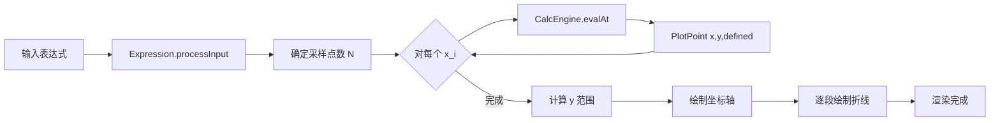

# 函数图像绘制 需求 SPEC v1.0（delta-spec）

> 本文为新增特性 `feat-function-graph` 的增量 spec。由于 `specs/specs/feat-function-graph/` 不存在，本 spec 即作为该特性的完整 spec。

---

## 系统背景

### 目的
为 OpenCalc HarmonyOS 用户在已有"四则/科学计算"基础上提供"函数图像绘制"能力，让用户能通过输入含变量 `x` 的表达式（如 `sin(x)`、`x^2`、`ln(x+1)`）在 Canvas 上直观查看函数曲线，辅助学习/教学/快速验证函数趋势。本特性不引入外部依赖、不修改持久化数据结构，最大化复用现有 `CalcEngine` / `Expression` 解析能力。

### 术语与缩写

| 术语/缩写 | 定义 |
| --------- | ---- |
| Plotter | 函数绘图模块，负责采样 + 曲线绘制 |
| GraphConfig | 绘图配置（x 范围、采样点数等） |
| PlotPoint | 一个采样点 `(x, y, defined)` |
| PlotResult | 一次绘图的产物（点序列 + 错误标志） |
| CalcEngine | 现有计算引擎（递归下降解析器） |
| Expression | 现有表达式预处理器（token 归一化） |
| Canvas | HarmonyOS ArkUI 提供的 `CanvasRenderingContext2D` 绘图组件 |
| 自变量 | 仅 `x`，由用户在表达式中显式引用 |
| 采样 | 对 x ∈ [xMin, xMax] 等间隔取 N 个点，对每点求 y = f(x) |
| 断点 | 函数在某个 x 不连续/未定义/数值溢出的点 |

---

## 系统上下文

### 目标系统

| 字段 | 内容 |
| ---- | ---- |
| 系统名称 | OpenCalc HarmonyOS — Function Graph 模块 |
| 系统边界说明（内部/外部判定依据） | 内部：`pages/GraphPage`、`calculator/Plotter`、`calculator/CalcEngine`（扩展）、`model/Models`（扩展）。外部：HarmonyOS ArkUI Canvas API、HarmonyOS Router、JS `Math` 内建函数。 |

### 周边交互方清单

| 编号 | 外部系统名称 | 类型 | 交互接口类型 | 交互接口主要功能 |
| ---- | ----------- | ---- | ----------- | --------------- |
| ES-01 | 终端用户 | 人 | UI | 输入表达式、点击"绘图"按钮、观察曲线、退出页面 |
| ES-02 | HarmonyOS ArkUI Canvas | 系统 Kit | API（`CanvasRenderingContext2D`、`CanvasComponent`） | 提供绘图上下文，承接坐标系/曲线绘制指令 |
| ES-03 | HarmonyOS Router（`@kit.ArkUI`） | 系统 Kit | API | CalculatorPage ↔ GraphPage 跳转 |
| ES-04 | JavaScript Math 标准库 | 协议栈 | API（`Math.sin/cos/log/...`） | 提供基础数学求值能力（已被 CalcEngine 内部使用） |

---

## 需求描述

| 需求编号 | 需求名称 | 需求描述 | 设计人员 |
| -------- | -------- | -------- | -------- |
| IR-001 | 函数图像绘制（V1） | 在 OpenCalc 中新增独立绘图页面，支持单函数 `y=f(x)` 在固定区间 [-10, 10] 上的曲线绘制，支持坐标轴 + 主题适配 + 错误提示，复用现有 CalcEngine 求值能力 | Jordan |

### 用户旅程

#### 旅程总览

| 旅程编号 | 旅程名称 | 目标用户/角色 | 旅程目标（G） | 触发与结束条件 | 关键体验路径 |
| ------- | -------- | ------------ | ------------ | ------------- | ----------- |
| J-01 | 查看函数曲线 | 学生/教师/普通用户 | 直观了解某个函数的形状/趋势 | 触发：在主页点击"绘图"按钮；结束：返回主页 / 退出应用 | KEP-001 |

### 关键体验路径（KEP）

- **KEP-001**：
  - 用户目标：输入函数表达式并查看曲线
  - 路径（起点→关键步骤→终点）：
    1. 计算器主页 → 点击顶部"绘图"按钮
    2. 进入 GraphPage，看到带 X/Y 轴 + 原点的空画布、表达式输入框、`x` 按钮、"绘图"按钮
    3. 输入 `sin(x)` → 点击"绘图"
    4. 画布内显示完整正弦曲线
    5. 修改表达式为 `x^2` → 再次点击"绘图"
    6. 画布内显示抛物线
    7. 点击返回，回到计算器主页
  - 体验预期（可验证表述）：
    - 从点击"绘图"按钮到 GraphPage 显示就绪 ≤ 500ms
    - 点击"绘图"按钮到曲线呈现 ≤ 300ms（200~600 采样点）
    - 错误表达式不导致崩溃，错误信息显示在 Canvas 下方

### 关键体验指标（KEI）

| 指标编号 | 指标名称 | 定义 | 底线值 | 达标值 | 挑战值 | 测量方法 |
| ------- | -------- | ---- | ------ | ------ | ------ | -------- |
| KEI-001 | 首屏绘图时长 | 点击"绘图"按钮 → 曲线渲染完成 | ≤ 500ms | ≤ 300ms | ≤ 150ms | 性能埋点（`Date.now()` 差值） |
| KEI-002 | 采样精度 | 每像素 ≥1 个采样点的画布占比 | ≥ 60% | ≥ 80% | ≥ 95% | 单元测试 |
| KEI-003 | 错误恢复率 | 错误表达式后下一次正确表达式可正常绘制的比例 | 100% | 100% | 100% | UI 测试 |

### 假设和约束

| 序号 | 约束类别 | 约束描述 | 对设计的影响 |
| ---- | -------- | -------- | ----------- |
| C-01 | 硬件限制 | 应用面向 HarmonyOS 手机/折叠屏，最小屏幕宽度 320 dp | Canvas 宽高自适应；采样点数下限 200 |
| C-02 | 外部系统接口 | 复用现有 `CalcEngine` / `Expression`，**不破坏**当前 API 的向后兼容性 | 新增 `evalAt()` 接口，原 `eval()` 不变 |
| C-03 | 用户特征约束 | 用户为普通消费者，不要求懂数学符号语法；支持中文错误提示 | 错误文本复用 `ErrorFlags` 的中文资源 |
| C-04 | 标准/规范约束 | 遵循 HarmonyOS ArkTS 编码规范、Stage 模型、声明式 UI | 全部 `.ets` 文件，使用 `@Component` / `@State` |
| C-05 | 法律法规约束 | 无网络/无外部数据采集 → 无 GDPR/隐私合规问题 | 不引入新权限 |
| C-06 | 出口管制 | 无加密/特殊算法 | 无影响 |
| C-07 | 其他硬约束 | 主线程不得阻塞 > 100ms；不使用 Worker（保持轻量） | 采样上限 600 点；防抖 300ms |

---

## 场景用例分析

### 场景清单

| 场景编号 | 场景名称 | 场景要素覆盖 | 优先级 | 备注 |
| -------- | -------- | ------------ | ------ | ---- |
| SC-001 | 正常绘制单函数曲线 | T=运行期 / G=查看曲线 / E=正常 / A=用户 / S=GraphPage 就绪 | P0 | 主场景 |
| SC-002 | 函数包含不连续/未定义点 | T=运行期 / G=查看曲线 / E=函数本身有断点 / A=用户 / S=GraphPage 就绪 | P0 | 1/x、tan(x)、log(x)、sqrt(x) |
| SC-003 | 表达式语法错误 | T=运行期 / G=查看曲线 / E=异常输入 / A=用户 / S=GraphPage 就绪 | P0 | 空输入/括号不匹配/未知符号 |
| SC-004 | 横竖屏切换 | T=运行期 / G=查看曲线 / E=旋转设备 / A=用户 / S=已绘制曲线 | P1 | Canvas 尺寸变化 |
| SC-005 | 主题切换后进入绘图 | T=运行期 / G=查看曲线 / E=用户先切了主题 / A=用户 / S=GraphPage 启动 | P1 | AMOLED / Material You |

---

### 场景 SC-001：正常绘制单函数曲线

#### 场景描述
用户在计算器主页点击"绘图"进入 GraphPage，输入合法的含 `x` 的表达式（如 `sin(x)`、`x^2`、`2*x+1`），点击"绘图"按钮后看到曲线。

#### 场景要素分析

| 场景要素 | 取值 |
| -------- | ---- |
| **T** 生命周期阶段 | 应用运行期 |
| **G** 场景目标 | 看到 y=f(x) 在 [-10, 10] 上的曲线 |
| **E** 环境 | 正常使用，屏幕亮、电池充足、无后台干扰 |
| **A** 参与者 | 终端用户 |
| **S** 系统状态 | GraphPage 已就绪，Canvas 已挂载 |

#### 用例识别

| 用例编号 | 用例名称 | 用例目的 | 用例描述 | 是否基础用例 |
| -------- | -------- | -------- | -------- | ------------ |
| UC-001-01 | 绘制单函数曲线 | 验证基本绘图通路 | 用户输入表达式并触发绘图，画布上出现曲线 | 是 |

#### 用例 UC-001-01：绘制单函数曲线

##### 简要说明
绘图主流程：表达式输入 → 表达式预处理 → 在 [-10,10] 等间隔采样 → CalcEngine 逐点求值 → 坐标变换 → Canvas 折线绘制。

##### Actor

| 角色 | 类型 | 与系统的关系 |
| ---- | ---- | ----------- |
| 终端用户 | 主，人 | 操作 UI |

##### 前置条件

| 场景要素 | 本用例采用的取值 | 对用例的影响点 | 处理方式 |
| -------- | ---------------- | -------------- | -------- |
| **T** 生命周期阶段 | 运行期 | 触发：用户启动 | 保持 |
| **G** 场景目标 | 看到曲线 | DoD：曲线可见 | 保持 |
| **E** 环境 | 正常 | 数据：表达式合法 | 保持 |
| **A** 参与者 | 终端用户 | 步骤：人工操作 | 保持 |
| **S** 系统状态 | GraphPage 就绪 | 前置：Canvas 已就绪 | 保持 |

##### 最小保证
- 用户输入不会导致应用崩溃
- 表达式输入框始终可编辑
- Canvas 至少绘制 X/Y 轴（即使没有曲线）

##### 成功保证（后置条件）
- Canvas 内显示与 y = f(x) 形状一致的连续折线段
- 错误信息区为空
- 表达式输入框保留用户输入

##### 触发事件
用户点击"绘图"按钮（或本期 V1 也可让 `x` 按钮后自动重绘 —— 实现阶段决定，本期默认按按钮触发）

##### 主成功路径（基本事件流）
```
1. 用户在 GraphPage 表达式输入框中键入 "sin(x)"
2. 用户点击"绘图"按钮
3. 系统读取当前表达式
4. 系统调用 Expression.processInput() 进行预处理（与计算器一致）
5. 系统按 N = clamp(canvasWidthPx/2, 200, 600) 决定采样点数
6. 系统在 x ∈ [-10, 10] 上以步长 (xMax-xMin)/(N-1) 采样
7. 对每个 x_i，调用 CalcEngine.evalAt(prepared, x_i) 求 y_i
8. 系统过滤 NaN/Infinity（标记 defined=false）
9. 系统根据所有有效 y_i 计算 y 范围 [yMin, yMax] 并加 10% padding
10. 系统清空 Canvas，绘制 X/Y 轴 + 原点
11. 系统按坐标变换 (x_i, y_i) → 像素坐标，逐段连线绘制
12. 当遇到 defined=false 或相邻 |Δy| 超过画布高度 5 倍时，断开当前折线
13. 完成绘制，UI 空闲
```

##### 扩展路径
```
2a. 用户没有点击按钮而是切换横竖屏 → 触发 onAreaChange → 自动重绘当前表达式
4a. Expression.processInput 抛出"括号不匹配/语法错误" → 跳转 SC-003 错误处理
5a. canvasWidthPx 尚未就绪（首帧）→ 等待 onReady 回调后再触发采样
7a. CalcEngine.evalAt 单点求值失败 → 该点 defined=false，继续下一点
9a. 全部点 defined=false（如 log(-x)） → 画布只显示坐标轴 + 错误信息"函数在该区间未定义"
```

##### 功能图



##### DFX 属性

| DFX 属性 | 是否涉及 | 要求（可验证表述） |
| -------- | -------- | ----------------- |
| 性能（时延/吞吐/并发） | 是 | 单次绘图主线程占用 ≤ 200ms（中端机 600 采样点） |
| 可靠性（故障恢复/数据一致性） | 是 | 见 FMEA 表 |
| 安全 | 否 | 无敏感数据 |
| 隐私 | 否 | 无数据采集 |
| 韧性 | 是 | 错误表达式后下一次合法表达式必须正常绘制 |
| 可服务性 | 否 | 不涉及在线服务 |
| 可测试性 | 是 | `Plotter.sample()` / `CalcEngine.evalAt()` 必须为可独立单测的纯函数 |
| 功耗 | 是 | 非交互态不重绘；防抖 300ms |
| 兼容性 | 是 | 与现有 CalcEngine / Expression API 完全向后兼容 |
| 大数据打点 | 否 | 不打点 |
| 隔离 | 否 | 不涉及 |
| 升级产品适配 | 否 | 首次新增功能 |
| 数据兼容性 | 否 | 不持久化 |
| 性能（关键体验） | 是 | KEI-001 ≤ 300ms |
| 其他 | 否 | — |

##### 业务威胁建模需求

> 本特性无网络/无持久化/无用户数据，威胁面非常窄，不涉及。

##### 可靠性分析需求（FMEA 消减措施清单）

| 异常事件编号 | 异常事件（Actor/环境/系统状态） | 影响 | 消减措施（可验证表述） | 触发检测/告警/日志 | 恢复与兜底 |
| ----------- | ----------------------------- | ---- | --------------------- | ------------------ | --------- |
| FM-01 | 用户输入语法错误表达式 | 无法绘制 | Expression 抛错被 try/catch 捕获 → 显示 `ErrorFlags.SYNTAX_ERROR` 中文文案 | 错误文案显示在 Canvas 下方 | 保持上次有效曲线显示？**否**：清空画布，仅保留坐标轴。表达式输入框保留用户输入 |
| FM-02 | 函数在 [-10,10] 内整段未定义（如 `sqrt(x-100)`） | 画布空白困惑 | 检测 `validCount === 0` → 显示中文文案"函数在该区间未定义" | UI 提示 | 保留坐标轴，提示文案常驻 |
| FM-03 | 函数存在不连续点（`1/x` 在 0 处） | 折线穿越无意义的远距离 | 断点检测：`|y_i - y_{i-1}| > 5 * canvasHeight` 时断开折线 | 无需告警 | 自动分段绘制 |
| FM-04 | CalcEngine 求值返回 NaN / Infinity | 折线异常 | PlotPoint.defined = false，断开折线 | 无需告警 | 跳过该点 |
| FM-05 | 单点求值耗时异常（极端递归） | 主线程阻塞 | 单点求值前置超时检查（每 100 点检查 `Date.now() - start > 100ms` 则提前结束并使用已采样点） | console.warn 日志 | 部分曲线渲染 + 提示"采样提前结束" |
| FM-06 | 数值溢出（如 `1e308 * x`） | y 范围异常 | 检测 |y| > 1e15 → 视为 defined=false | 无需告警 | 视为断点 |
| FM-07 | 极小数噪声（`(1e-15) * x`） | 曲线毛刺/全 0 | |y| < 1e-10 时归零；y 范围低于 1e-6 时退化为单值显示 | 无需告警 | 归零处理 |
| FM-08 | Canvas 尚未挂载完成（首帧） | NPE | onReady 回调后才允许触发首次绘图 | 内部状态机 | 等待回调 |
| FM-09 | 横竖屏切换时正在绘图 | 中间态显示混乱 | 监听 onAreaChange，防抖 300ms 后重绘 | 无需告警 | 自动重绘 |
| FM-10 | 表达式中无 `x`（如 `2+3`） | 退化为常函数 | 视为合法 → 显示水平直线 y = 常量 | 无需告警 | 正常绘制 |
| FM-11 | 用户连续点击"绘图"按钮 | 重复计算/抖动 | 按钮防抖 300ms，绘制中状态置 disabled | UI 状态置灰 | 自动恢复 |
| FM-12 | 内存压力（连续上千次绘图） | 内存泄漏 | 不缓存 PlotResult，使用本地变量 + Canvas 直接 `clearRect` 重置 | 无需告警 | 自然回收 |
| FM-13 | 进入 GraphPage 后立即返回 | 残留计时器 | aboutToDisappear 清理防抖 timer | 无需告警 | 资源释放 |

##### 验证达成标准
- 输入 `sin(x)` 显示完整正弦曲线（至少 3 个完整周期）
- 输入 `x^2` 显示开口向上的抛物线，最低点在原点
- 输入 `1/x` 显示双曲线，x=0 附近断开
- 输入 `tan(x)` 显示带断点的曲线
- 输入空表达式 → 错误提示"请输入表达式"
- 输入 `sin(` → 错误提示语法错误
- 横竖屏切换后曲线重绘正常
- 主题切换后曲线/轴颜色匹配主题

##### 是否影响架构

| 是否影响 | 影响范围 | 影响类型 | 影响描述 |
| -------- | -------- | -------- | -------- |
| 否 | — | — | 仍在 MVVM-Lite（Page + Engine + Model）分层；新增一个 Page、一个 Plotter 模块、几个 Model 类型 |

##### 功能影响列表

| 功能编号 | 功能描述 | 影响类型 | 影响描述 |
| ------- | -------- | -------- | -------- |
| FUNC-01 | CalculatorPage 顶部菜单 | 修改 | 新增"绘图"按钮，点击 → `router.pushUrl({ url: 'pages/GraphPage' })` |
| FUNC-02 | CalcEngine | 修改（扩展） | 新增方法 `evalAt(prepared, x): number`，保留原 `eval()` |
| FUNC-03 | Expression | 复用 | 不修改，但需确保 `x` 作为 token 不被预处理误吞 |
| FUNC-04 | GraphPage | 新增 | 整页面 |
| FUNC-05 | Plotter | 新增 | 采样 + 绘制 |
| FUNC-06 | Models（GraphConfig/PlotPoint/PlotResult） | 新增 | 数据结构 |
| FUNC-07 | 资源（color/string/main_pages） | 修改 | 补充资源 |

##### 需求分解列表（IR → SR）

| IR 编号 | SR 编号 | SR 名称 | SR 描述 | 关联功能 | 关联功能编号 |
| ------ | ------ | ------ | ------- | ------- | ----------- |
| IR-001 | SR-001 | 计算器主页新增"绘图"入口 | 顶部菜单栏增加按钮，点击跳转 GraphPage | 顶部菜单 | FUNC-01 |
| IR-001 | SR-002 | 新增 GraphPage 页面 | 含表达式输入框、`x` 按钮、"绘图"按钮、Canvas、错误提示行 | 整体 UI | FUNC-04 |
| IR-001 | SR-003 | CalcEngine 支持自变量求值 | 新增 `evalAt(prepared, x)` 接口，等价于把表达式中的 `x` 全部替换为输入值后求 `eval` | 求值引擎 | FUNC-02 |
| IR-001 | SR-004 | 新增 Plotter 采样 + 绘制模块 | 采样、断点检测、y 范围适配、Canvas 绘制 | 绘图核心 | FUNC-05 |
| IR-001 | SR-005 | 坐标系绘制 | X/Y 轴 + 原点；不含刻度/网格/标签 | 坐标系 | FUNC-05 |
| IR-001 | SR-006 | 主题适配 | 曲线/轴颜色随主题切换 | 主题 | FUNC-07 |
| IR-001 | SR-007 | 横竖屏适配 | onAreaChange 重绘 | 自适应 | FUNC-04/05 |
| IR-001 | SR-008 | 错误提示 | 语法错误/全段未定义时显示中文文案 | UI | FUNC-04 |
| IR-001 | SR-009 | 性能与防抖 | 主线程阻塞 ≤ 200ms；输入/横竖屏触发的重绘防抖 300ms；绘图中按钮置灰 | 性能 | FUNC-04/05 |
| IR-001 | SR-010 | 不连续点处理 | NaN/Infinity/|Δy| 超阈值断开折线 | 可靠性 | FUNC-05 |
| IR-001 | SR-011 | 资源补充 | 补充字符串"绘图"、错误文案、颜色资源 | 资源 | FUNC-07 |

---

### 场景 SC-002：函数包含不连续/未定义点

#### 场景描述
用户输入 `1/x`、`tan(x)`、`sqrt(x)`、`log(x)` 等在 [-10, 10] 内存在不连续/部分未定义的函数。

#### 场景要素分析

| 场景要素 | 取值 |
| -------- | ---- |
| **T** 生命周期阶段 | 运行期 |
| **G** 场景目标 | 看到曲线（局部未定义处自然断开） |
| **E** 环境 | 表达式本身有定义域限制 |
| **A** 参与者 | 用户 |
| **S** 系统状态 | GraphPage 就绪 |

#### 用例识别

| 用例编号 | 用例名称 | 用例目的 | 用例描述 | 是否基础用例 |
| -------- | -------- | -------- | -------- | ------------ |
| UC-002-01 | 不连续/部分未定义函数绘制 | 验证断点处理 | 1/x 在 0 处断开，tan(x) 在 π/2+kπ 处断开，sqrt(x) 仅绘制 x≥0 段 | 是 |

#### 用例 UC-002-01

##### 简要说明
对每个采样点求值，将 NaN/Infinity/|y| 超阈值标记为 defined=false；绘制时遇 defined=false 或相邻 |Δy| 超过画布高度 5 倍即断开折线。

##### 触发事件
用户输入 `1/x` 等表达式并点击"绘图"。

##### 主成功路径
```
1. 用户输入 "1/x"
2. 点击"绘图"
3. Plotter 按 600 点采样
4. 在 x≈0 附近，CalcEngine.evalAt 返回 ±Infinity
5. 这些点 defined=false
6. 绘制时遇 defined=false → 断开折线，启动新段
7. 画布显示两段曲线，x=0 附近无连线
```

##### 扩展路径
```
4a. 极个别采样点恰好落在 x=0 → 略过该点
6a. 相邻两点都 defined=true 但 |Δy| > 5 * canvasHeight → 视为不连续，断开
```

##### DFX 属性
（继承 UC-001-01）

##### 可靠性分析需求

> 关键 FMEA 已在 UC-001-01 中统一登记（FM-03、FM-04、FM-06）

##### 验证达成标准
- `1/x` 在 x=0 处明显断开，x<0 和 x>0 两段双曲线形状正确
- `tan(x)` 在 π/2、3π/2 等位置断开
- `sqrt(x)` 在 x<0 区域无曲线，x≥0 区域曲线正常
- `log(x)` 在 x≤0 区域无曲线，x>0 区域正常

##### 是否影响架构
| 是否影响 | 影响范围 | 影响类型 | 影响描述 |
| -------- | -------- | -------- | -------- |
| 否 | — | — | 复用 UC-001-01 架构 |

##### 功能影响列表
| 功能编号 | 功能描述 | 影响类型 | 影响描述 |
| ------- | -------- | -------- | -------- |
| FUNC-05 | Plotter 断点检测 | 修改 | 实现 defined 标志 + |Δy| 阈值判定 |

##### 需求分解列表
> 已在 IR-001 → SR-010 中体现

---

### 场景 SC-003：表达式语法错误

#### 场景描述
用户输入空表达式、括号不匹配、未知符号等非法表达式。

#### 场景要素分析

| 场景要素 | 取值 |
| -------- | ---- |
| **T** 生命周期阶段 | 运行期 |
| **G** 场景目标 | 看到错误提示，不崩溃 |
| **E** 环境 | 异常输入 |
| **A** 参与者 | 用户 |
| **S** 系统状态 | GraphPage 就绪 |

#### 用例识别

| 用例编号 | 用例名称 | 用例目的 | 用例描述 | 是否基础用例 |
| -------- | -------- | -------- | -------- | ------------ |
| UC-003-01 | 错误表达式不崩溃 | 韧性 | 显示中文错误信息并保持页面可用 | 是 |

#### 用例 UC-003-01

##### 简要说明
表达式预处理或求值失败 → 显示错误文案 → 保留输入 → 不影响下一次合法输入。

##### 主成功路径
```
1. 用户输入 "sin(" 或留空
2. 点击"绘图"
3. Expression.processInput 抛错 → catch
4. 设置 errorMsg = "表达式语法错误"
5. 清空 Canvas，仅绘制坐标轴
6. errorMsg 显示在 Canvas 下方红色文本
7. 用户修改输入为 "sin(x)" → 点击"绘图" → errorMsg 清空，曲线正常绘制
```

##### 扩展路径
```
1a. 用户输入完全空 → 错误文案"请输入表达式"
1b. 用户输入 "x" → 退化为 y=x 直线（非错误）
1c. 用户输入 "abc" → 错误"未知符号"
3a. CalcEngine 求值阶段才报错（如除零）→ 见 FM-04，单点 defined=false
```

##### DFX 属性
| DFX 属性 | 是否涉及 | 要求 |
| -------- | -------- | ---- |
| 韧性 | 是 | 错误后下一次必须能恢复 |
| 可测试性 | 是 | 错误文案必须为可测试的字符串 |

##### 可靠性分析需求
> 见 UC-001-01 FM-01

##### 验证达成标准
- 输入空 → "请输入表达式"
- 输入 "sin(" → "表达式语法错误"
- 输入 "abc" → "未知符号" 或语法错误
- 错误后下一次 "sin(x)" 必须能正常绘制（KEI-003）

##### 是否影响架构
| 是否影响 | 影响范围 | 影响类型 | 影响描述 |
| -------- | -------- | -------- | -------- |
| 否 | — | — | — |

##### 功能影响列表
| 功能编号 | 功能描述 | 影响类型 | 影响描述 |
| ------- | -------- | -------- | -------- |
| FUNC-04 | GraphPage 错误提示行 | 新增 | Canvas 下方一行红色文本 |

##### 需求分解列表
> 已在 SR-008 中体现

---

### 场景 SC-004：横竖屏切换

#### 场景描述
用户已绘制 `sin(x)` 曲线，旋转设备触发横竖屏切换。

#### 用例 UC-004-01：横竖屏切换重绘

##### 简要说明
监听 Canvas `onAreaChange`（或页面 `onWindowSizeChange`），尺寸变化时清空画布并基于新尺寸重新采样 + 重绘。

##### 主成功路径
```
1. 用户已绘制 sin(x)
2. 设备旋转至横屏
3. Canvas onAreaChange 触发
4. 防抖 300ms 后调用 redraw()
5. 新画布尺寸下重新计算采样点数 N
6. 重新采样 + 绘制
```

##### 扩展路径
```
4a. 旋转过程中再次旋转 → 防抖 timer 重置，只重绘一次
```

##### 可靠性分析需求
> 已在 FM-09 中体现

##### 验证达成标准
- 横竖屏切换后曲线完整无残留
- 切换期间不卡顿

##### 是否影响架构 / 功能影响 / 需求分解
> 不影响架构；体现在 SR-007、SR-009

---

### 场景 SC-005：主题切换后进入绘图

#### 场景描述
用户先切换主题（默认 / AMOLED / Material You 暗色），再进入 GraphPage。

#### 用例 UC-005-01：主题适配

##### 简要说明
GraphPage 读取 `PreferencesStore.getTheme()` → 选择对应配色 → 应用到曲线/轴/原点/错误文本。

##### 主成功路径
```
1. 用户在设置中切换为 AMOLED
2. 返回主页
3. 进入 GraphPage
4. GraphPage onAppear 读取主题
5. Canvas 背景纯黑、轴白色、曲线高对比色（如青色）
```

##### 扩展路径
```
2a. 用户在 GraphPage 内调出设置切换主题 → 重新读取主题并重绘
```

##### 可靠性分析需求
> 无特殊；FM-12 涵盖内存

##### 验证达成标准
- 三种主题下颜色清晰可辨
- 错误文本在 AMOLED 主题下仍可读

##### 是否影响架构 / 功能影响 / 需求分解
> 不影响架构；体现在 SR-006、SR-011

---

## 系统需求列表（SR）

| SR 编号 | IR 编号 | SR 名称 | SR 描述（What） | 关联功能 | 利益相关者 | 系统对外能力行为 | 关联用例/场景 | 可验证达成标准 | 优先级 | 需求来源 |
| ------ | ------ | ------ | --------------- | -------- | --------- | ---------------- | ------------- | -------------- | ------ | -------- |
| SR-001 | IR-001 | 计算器主页"绘图"入口 | CalculatorPage 顶部菜单新增"绘图"按钮，点击跳转 GraphPage | FUNC-01 | 用户 | 路由跳转 | UC-001-01 | 按钮可见、点击 500ms 内进入 GraphPage | 高 | 业务需求 |
| SR-002 | IR-001 | GraphPage 界面 | 含表达式输入、`x` 按钮、"绘图"按钮、Canvas、错误提示行 | FUNC-04 | 用户 | UI 呈现 | UC-001-01/UC-003-01 | 界面元素齐全 | 高 | 业务需求 |
| SR-003 | IR-001 | CalcEngine 自变量求值 | 新增 `evalAt(prepared, x)`：对表达式中的 `x` 代入数值求值 | FUNC-02 | 开发 | 接口能力 | UC-001-01 | 单测覆盖 sin/x^2/1/x 等 | 高 | 设计派生 |
| SR-004 | IR-001 | Plotter 采样与绘制 | 等间隔采样 + 断点检测 + Canvas 折线绘制 | FUNC-05 | 开发 | 内部能力 | UC-001-01/UC-002-01 | 单测 + UI 验证 | 高 | 设计派生 |
| SR-005 | IR-001 | 坐标系绘制 | X/Y 轴 + 原点 | FUNC-05 | 用户 | UI 呈现 | UC-001-01 | 轴可见 | 高 | 业务需求 |
| SR-006 | IR-001 | 主题适配 | 三种主题颜色适配 | FUNC-07 | 用户 | UI 呈现 | UC-005-01 | 三种主题可视 | 中 | 体验一致性 |
| SR-007 | IR-001 | 横竖屏适配 | onAreaChange 重绘，防抖 300ms | FUNC-04/05 | 用户 | UI 呈现 | UC-004-01 | 切换后正常 | 中 | 体验一致性 |
| SR-008 | IR-001 | 错误提示 | 中文错误文案显示 | FUNC-04 | 用户 | UI 呈现 | UC-003-01 | 错误信息正确显示 | 高 | 可靠性 |
| SR-009 | IR-001 | 性能与防抖 | 主线程 ≤200ms；按钮防抖 300ms | FUNC-04/05 | 用户/开发 | 非功能 | UC-001-01 | KEI-001 达标 | 高 | C-07 / FM-05/11 |
| SR-010 | IR-001 | 断点处理 | NaN/Infinity/|Δy| 超阈值断开 | FUNC-05 | 用户 | 内部 | UC-002-01 | 1/x/tan(x)/sqrt(x) 验证 | 高 | FM-03/04/06 |
| SR-011 | IR-001 | 资源补充 | 字符串、颜色资源 | FUNC-07 | 用户 | UI 呈现 | 各场景 | 资源在三种主题下可用 | 中 | 业务需求 |
| SR-012 | IR-001 | 异常恢复 | 错误后下一次成功率 100% | FUNC-04/05 | 用户 | 韧性 | UC-003-01 | KEI-003 达标 | 高 | FM-01/02 |
| SR-013 | IR-001 | 资源释放 | 退出页面时清理 timer | FUNC-04 | 开发 | 内部 | — | 离页无残留 | 中 | FM-13 |

---

## 总结

- 13 个 SR 全部来源于场景用例分析
- 13 条 FMEA 故障模式已转化为 SR-008/009/010/012/013 等需求约束（无遗漏）
- 复杂度等级：**中**；不影响架构（参见 §"是否影响架构" 表）
- 后续：step5 代码仓理解 → step6 复杂度评估 → step7 跳过架构变更 → step8 mod-design 产出 delta-design.md → step9 设计审视
